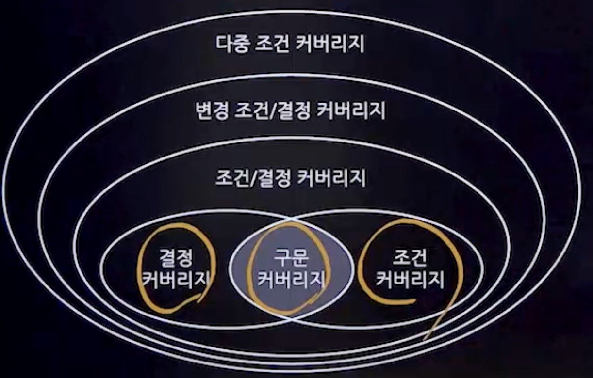

## 1. 소프트웨어 테스트
### 1. 개념
- 구현된 소프트웨어가 사용자의 요구사항(기능,성능,사용성,안정성 등)을 만족하는지 확인하며 결함을 찾는 활동
- 결함(Fault)을 발견하기 위한 절차와 행위
- 품질 평가를 위해 소프트웨어를 실행하는 과정
- 소프트웨어의 결함을 식별하고 품질을 보장하며 개선하기 위한 활동
### 2. 소프트웨어 테스트의 필요성
- 오류 발견 관점
  - 결함을 찾아 수정
- 오류 예방 관점
  - 결함 발생을 방지
- 품질 향상 관점
  - 소프트웨어의 전반적인 품질을 향상
### 3. 소프트웨어 테스트의 기본 원칙
- 테스팅은 결함을 찾아내는 활동
- 완벽한 테스팅은 불가능하다.
- 테스팅은 개발 초기에 시작해야 한다.
- 결함 집중(Defect Clustering)
- 애플리케이션 결함의 대부분은 소수의 특정한 모듈에 집중되어 존재한다.
- 파레토 법칙
  - 전체 결과의 80%가 전체 원인의 20%에서 일어나는 현상
- 살충제 패러독스
  - 반복적인 테스트로는 새로운 결함을 찾기 어렵다.
- 테스팅 방법은 특정 상황에 의존적이다.
- 오류-부재의 궤변
  - 오류가 없다고 해도 사용자의 요구사항을 충족하지 않으면 품질이 좋다고 할 수없다.

#### 4. 테스트 프로세스
- 테스트 계획
- 테스트 분석 및 디자인
- 테스트 케이스 및 시나리오 작성
- 테스트 수행
- 테스트 결과 평가 및 리포팅

### 5. 테스트 산출물
- 테스트 계획서
  - 테스트의 전반적인 계획 및 목적, 범위, 절차, 일정, 역할 및 책임 등을 정의한 문서
- 테스트 케이스
  - 테스트 항목의 입력, 실행 조건 및 기대 결과를 포함한 명세서
- 테스트 시나리오
  - 테스트 케이스 동작 순서를 기술한 문서
- 테스트 결과서
  - 테스트의 결과와 평가를 정리한 문서

## 2. 테스트 오라클
### 1. 개념
- **테스트의 결과가 참인지 거짓인지를 판단하기 위해서 사전에 정의된 참값을 입력**하여 비교하는 기법 및 활동
### 2. 테스트 오라클의 유형
- 참 오라클(True)
  - 모든 입력값에 대해 정확한 결과를 생성하는 오라클
  - 오류를 완벽하게 검출할 수 있으며, 크리티컬한 시스템(항공기, 임베디드 시스템)에서 사용
- 샘플링 오라클
  - 제한된 입력 값들에 대해서만 예상되는 결과를 제공하는 오라클
  - 대부분의 일반적인 소프트웨어에서 사용
- 휴리스틱 오라클
  - 특정 입력값들에 대해서는 정확한 결과를 제공하나, 그 외의 값들에 대해서는 근사적인(추정) 결과를 제공하는 오라클
- 일관성 검사 오라클
  - 소프트웨어의 변경 전후로 테스트 결과의 일관성을 검증하는 오라클
  - 소프트웨어의 변경이 있을 때, 변경 전후의 결과가 동일한지를 확인

## 3. 테스트 레벨

### 1. 단위 테스트
- 개별 소프트웨어 모듈 또는 구성요소의 기능적, 비기능적 측면을 검증하는 테스트 프로세스의 첫 단계
- 테스트 케이스는 주로 모듈 설계 단계에서 준비하며, 코드를 작성한 개발자에 의해 실행됨
- 주요 목적 : 모드의 효율성, 코딩 표준 준수, 기능의 정확성 등을 검증
### 2. 통합 테스트
- 여러 모듈 또는 서브시스템을 통합하고, 그 사이의 인터페이스 및 상호작용을 검증하는 테스트
- 주요 목적 : 인터페이스 오류 및 모듈 간 상호작용 중 발생할 수 있는 문제점 검출
### 3. 시스템 테스트
- 완전히 통합된 소프트웨어를 대상으로 한 테스트로, 소프트웨어와 시스템 사양 간의 일치성 검증
- 기능적 요구사항뿐만 아니라 비기능적 요구사항에 대한 검증도 포함 
#### 시스템 테스트 유형
- 기능 테스트
  - 고객의 기능적 요구사항을 중점적으로 테스트한다.
  - 요구사항에 따른 기능의 구현 여부 및 동작 여부에 대해 테스트를 진행한다.
  - 테스트 기준은 명세에 따라 확인한다.
- 비기능 테스트
  - 고객의 성능 요구사항을 중점적으로 테스트한다.
  - 성능, 신뢰성, 안정성, 유효성, 적합성 등을 확인한다.
  - 확인하고자 하는 특성에 따라 환경과 도구가 필요하다.
### 4. 인수테스트
- 시스템을 배포하거나 실제 사용할 만한 준비가 되었는지에 대한 평가
- 사용자가 요구분석 명세서에 명시된 사항을 모두 충족하는지 판정하고, 시스템이 예상대로 동작하고 있는지를 판정하는 방안을 파악
#### 인수테스트 유형
- 알파테스트
  - 개발자의 통제하에 사용자가 개발환경에서 수행하는 테스트
- 베타테스트
  - 개발된 소프트웨어를 사용자가 실제 운영환경에서 수행하는 테스트
- 사용자 인수 테스트
  - 사용자가 시스템 사용의 적절성을 확인
- 운영상 인수 테스트
- 계약 인수 테스트
- 규정 인수 테스트

## 4. 소프트웨어 테스트 기법
### 1. 프로그램 실행 여부
#### 1. 정적 테스트
- 소프트웨어의 실행 없이 소스 코드나 설계 문서 등을 분석하여 문제점을 찾는 테스트 방식
- 경로 분석, 제어 흐름 분석, 데이터 흐름 분석 등을 수행
##### 종류
- 코드 검사
  - 소스 코드의 오류를 검사
- 워크스루
  - 계획된 개발자 검토 회의이다.
  - 개발자가 작성한 코드를 팀원에게 설명하며 오류를 찾는 회의 형태
- 인스펙션
  - 검토 전문가들이 소스코드를 분석하여 결함을 발견하는 공식적인 검토
#### 2. 동적 테스트
- 실제로 소프트웨어를 실행하며 문제점을 찾는 테스트 방식
- 다양한 환경에서 소프트웨어 동작을 실제로 검증한다. 

### 2. 테스트 기법
#### 1. 화이트박스 테스트
- 소프트웨어의 내부 구조와 동작을 중점으로 검사하는 테스트
- 개발자 관점의 단위 테스트 방법
- 문장검증
- 선택(분기)검증
- 경로검증
- 조건검증
#### 2. 기초 경로 검사
- McCabe가 제안한 것으로 대표적인 화이트박스 테스트 기법

#### 3. 블랙박스 테스트(중요)
- 프로그램의 사용자 요구사항 명세를 보면서 테스트
- 주로 구현된 기능을 테스트
- 사용자가 소프트웨어에 요구하는 사항과 결과물이 일치하는지 확인
- 사용자 관점의 테스트 방법
- 동등 분할 기법
  - 입력 자료에 초덤을 맞춰 테스트 케이스를 만들어 검사하는 방법
- 경계값 분석
  - 경계값에서 오류가 발생할 확률이 높다는 점을 이용해 입력 조건의 경계값을 테스트 케이스로 선정한다.
  - 80 ~ 90의 입력 조건이 있을 때, 79,80,81,89,90,91을 테스트 값으로 선정한다.
- 원인 - 효과 그래프 검사
  - 입력 데이터 간의 관계와 출력에 영향을 미치는 상황을 체계적으로 분석한 다음 효용성이 높은 테스트 케이스를 선정하여 검사하는 기법
- 오류 예측 검사
  - 과거의 경험이나 테스터의 감각으로 테스트하는 기법
- 비교 검사
  - 여러 버전의 프로그램에 동일한 테스트 자료를 제공하여 동일한 결과가 출력되는지 테스트하는 기법이다.
- 상태 전이 검사
  - 시스템에 반영되는 이전의 상태가 무엇인지, 상태 간 전이, 상태를 변화시기키는 이벤트와 입력값을 파악한다.

### 3. 테스트에 대한 시각
#### 1. 검증(Verification)
- 소프트웨어의 개발 과정을 테스트
- 올바른 소프트웨어가 만들어지고 있는지 검증
#### 2. 확인(Validation)
- 완성된 소프트웨어의 결과를 테스트
- 완성된 소프트웨어가 정상적으로 동작하는지 확인
- 완성된 소프트웨어가 사용자의 요구사항을 만족하는지 확인

### 4. 테스트 목적
- 회복
  - 시스템에 고의로 실패를 유도하고 시스템이 정상적으로 복귀하는지 테스트
- 안전
  - 불법적인 소프트웨어가 접근하여 시스템을 파괴하지 못하도록 소스코드 내의 보안적인 결함을 미리 점검하는 테스트
- 강도
  - 시스템에 과다 정보량을 부과하여 과부하 시에도 시스템이 정상적으로 작동되는지 검증하는 테스트
- 성능
  - 시스템의 응답하는 시간, 처리량, 반응속도 등을 테스트
- 구조
  - 시스템의 내부 논리 경로, 소스코드의 복잡도를 평가하는 테스트
- 회귀
  - 변경 또는 수정된 코드에 대하여 새로운 결함 발견 여부를 평가하는 테스트
- 병행
  - 변경된 시스템과 기존 시스템에 동일한 데이터를 입력 후 결과를 비교하는 테스트
- A/B 테스트
  - 기존 서비스 A와 새로 적용하고싶은 서비스 B를 통계적인 방법으로 비교하여 새로운 서비스가 기존 서비스에 비해 정말 효ㄱ과가 있는지 알아보는 테스트
- 스모크 테스트
  - 본격적인 테스트 수행에 앞서 테스트 환경의 테스트가 가능한지 여부를 판단하기 위해 간단하게 테스트

### 5. 테스트 종류
#### 1. 명세 기반 테스트
- 주어진 명세를 빠짐없이 테스트 케이스로 구현하고 있는지 확인하는 테스트

#### 2. 구조 기반 테스트
- 소프트웨어 내부 논리 흐름에 따라 테스트 케이스를 작성하고 확인하는 테스트
- 문장 검증, 선택(분기) 검증, 경로 검증, 조건 검증 등

#### 3. 경험 기반 테스트
- 경험이 많은 테스터의 직관과 기술 능력을 기반으로 수행하는 테스트

## 5. 테스트 커버리지
### 1. 개념
- 주어진 테스트 케이스에 의해 수행하는 소프트웨어의 테스트 범위를 측정하는 테스트 품질 측정 기준
- 테스트의 정확성과 신뢰성을 향상시키는 혁할
- **테스트를 얼마나 수행했는지 측정하는 기준**

### 2. 유형
#### 1. 기능 기반 커버리지
- 테스트 대상 애플리케이션의 전체 기능을 모수로 설정하고, 실제 테스트가 수행된 기능의 수를 측정하는 방법
- 기능 기반 테스트 커버리지는 100% 달성을 목표로 하며, 일반적인 UI가 많은 시스템의 경우 화면 수를 모수로 사용할 수도 있다.

#### 2. 라인 커버리지
- 애플리케이션 전체 소스 코드의 라인수를 모수로 테스트 시나리오가 수행한 소스 코드의 라인수를 측정하는 방법

#### 3. 코드 커버리지
- 소프트웨어 테스트 충분성 지표 중 하나로 소스 코드의 구문, 조건, 결정 등의 구조 코드 자체가 얼마나 테스트 되었는지를 측정하는 방법

#### 1. 구문 커버리지
#### 2. 조건 커버리지
- 결정포인트 내의 모든 개별 조건식에 대해 수행하는 테스트 커버리지를 말한다.
- 개별 조건식이 각각, Ture, False만 만족하면 된다.
- 개별 조건식의 T/F는 커버되지만 전체 결졍포인트의 T/F는 보장받지 못한다.
#### 3. 결정포인트 내의 모든 분기문에 대해 수행하는 테스트 커버리지를 말한다.
- 결정포인트가 각각, True와 False만 만족하면 된다.
- 개별 조건식에서 오류가 있는 경우 찾지 못할 수 있다.
#### 4. 조건/결정 커버리지
- 결정포인트 T/F, 개별조건식 T/F를 가져야 한다. 