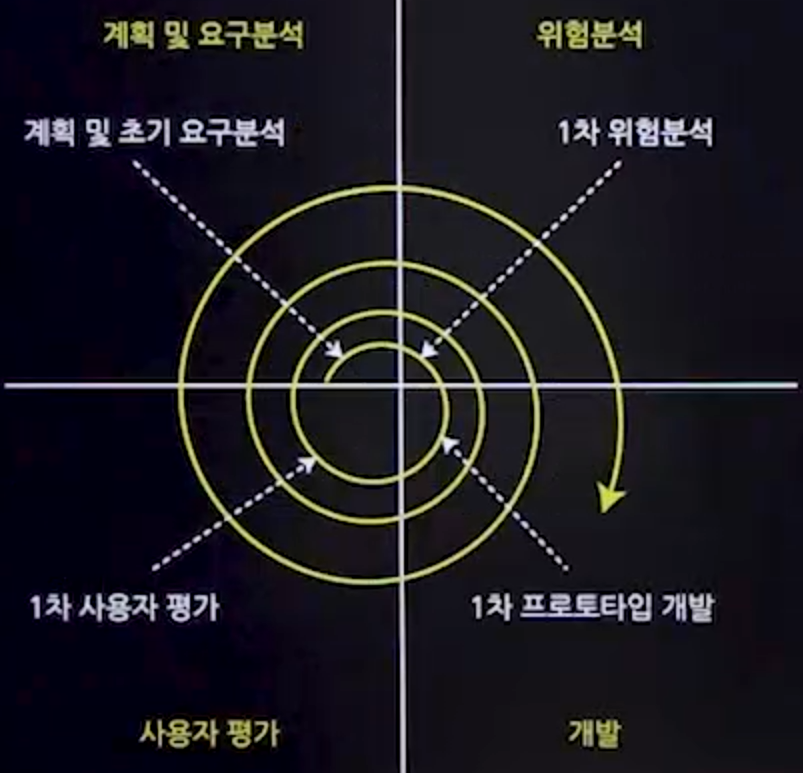

# 소프트웨어 개발 방법론

## 1. 소프트웨어 개발 방법론 개념
- 소프트웨어 개발에 필요한 과정(절차,방법,산출물,기법,도구)들을 체계적으로 정리한 것

## 2. 소프트웨어 개발 방법론 종류
### 1. 구조적 방법론(하향식)
- 절차적인 소프트웨어 개발 방법론
- 제한된 구조 안에서 코드를 생성하여 순차적으로 실행하는 방식
#### 구조적 방법론 과정
- 요구사항 분석 -> 구조적 분석 -> 구조적 설계 -> 구조적 프로그래밍
#### 구조적 방법론 구성요소

|구성요소|설명|
|-------|----|
|데이터 흐름도 (DFD)|시스템 내의 데이터 흐름을 그래픽으로 표현|
|자료사전 (DD)|시스템에서 사용되는 데이터의 세부사항을 문서화|
|상태전이도 (STD)|시스템의 상태 변화를 시각적으로 표현|
|소단위 명세서 (Minispec)|개별 모듈의 기능과 로직을 상게하게 기술|

### 2. 정보공학 방법론
- <b>기업의 주요 부분을 계획, 분석, 설계 구축에 정형화된 기법들을 상호 연관성 있게 통합하여 적용하는 방법론
- 데이터 중심의 접근 방식</b>
#### 정보공학 방법론 기본 개발 과정
- 정보전략계획 수립단계 -> 업무영역 분석단계 -> 시스템 설계단계 -> 시스템 구축단계

### 3. 객체지향 개발 방법론(상향식)
- 현실 세계의 개체(Entity)를 속성(Attribute)과 메서드(Method)로 표현
- 객체와 클래스간의 관계를 식별하고 설계 모델로 변환
#### 특징
- 캡슐화 : 객체의 세부 구현을 숨기고 인터페이스만을 제공
- 정보은닉 : 객체 내부의 세부 사항을 외부로부터 숨김
- 상속 : 재사용성과 확장성을 위해 상위 클래스의 속성과 메서드를 하위 클래스가 상속
- 다형성 : 하나의 인터페이스가 다양한 형태의 구현을 가질 수 있다.
  - 오버로딩 : 메서드 중복정의
  - 오버라이딩 : 메서드의 재정의
- 추상화 : 복잡한 현실 세계를 단순화하여 모델링
  - ex) 다양한 가전제품의 리모콘의 껍데기를 하나의 공장에서 만든다.
#### 개발과정
- 분석,설계,구현을 객체 중심으로 수행
- 전체 프로세스의 일관성 유지 및 재사용성 강조

### 4. CBD(Component Based Development)
- 재사용 가능한 컴포넌트의 개발 또는 상용 컴포넌트를 조합하여 애플리케이션 개발
- 새로운 기능 추가가 용이한 확장성 제공
#### 특징
- 확장성
- 생산성 및 품질 향상
- 유지보수 및 비용 최소화

### 5. 애자일 방법론
- 변화에 빠르고 유연하게 대응하는 개발 방식
- 소프트웨어 개발의 민첩성과 효율성 강조

#### 종류
- <b>XP(eXtreme Programming)
  - 반복적이고 점진적인 개발을 강조
- SCRUM
  - 유연하고 생상적인 프로젝트 관리 방식</b>
- FDD(Feature-Driven Development)
  - 기능 중심의 반복적 개발 방식
- Crystal 방법론
  - 프로젝트의 크기와 중요도에 따라 방법론을 조정
## 3. 소프트웨어 개발 모델
### 1. 폭포수모델(Waterfall Model)
|특징|설명|
|---|-----|
|순차적 접근|개발 과정이 계획, 분석, 설계, 구현, 테스트, 운영의 순서로 진행된다|
|단계별 검증|각 단계는 이전 단계가 완료된 후에 시작되며, 다음 단계로 넘어가기 전에 검증을 거친다.|
|병행 및 반복 진행의 부재|한 번 시작된 단계는 이전 단계로 돌아가거나 병행 진행이 허용되지 않는다.|
|경험 및 성공사례|소프트웨어 개발의 오래된 모델로, 다양한 성공 사례가 있다|
|요구사항 변경의 어려움|초기에 설정된 요구사항을 나중에 변경하기 어렵다|
|단계별 명확성|각 단계는 명확한 목표와 산출물을 가진다|
|고객 피드백의 부족|개발 과정 중 고객의 피드백을 적극적으로 받기 어렵다|
|유연성 부족|시장이나 기술의 변화에 빠르게 대응하기 어렵다|
### 2. 프로토타이핑 모델(Prototyping Model)
- 고객이 요구하는 주요 기능을 프로토타입으로 먼저 구현하는 모델이다.
- 개발자는 프로토타입을 통해 소프트웨어의 모델을 만들어 요구사항을 명확히 한다.
- 개발된 프로토타입은 폐기되거나 재사용될 수 있다.
### 3. 나선형 모델(Spiral Model)
- 폭포수 모델과 프로토타이핑 모델의 장점을 통합하고, 위험 분석을 추가하여 점증적으로 개발을 진행하는 모델
- 프로젝트 수행 시 발생할 수 있는 위험을 관리하고 최소화하는 것을 목적으로 한다.
- 대규모 프로젝트나 위험 부담이 큰 시스템 개발에 적합하다.
#### 순서(매우중요)

1. 계획
2. 분석
3. 개발
4. 사용자 평가
### 4. RAD(Rapid Application Development)모델
- **매우 빠른 개발 주기를 통해 소프트웨어를 신속하게 제공한다.**
- **고급 소프트웨어 개발 도구와  CASE도구를 활용하여 개발 효율성을 높인다.**
- 개발 과정에서 프로토타이핑을 중요시하여 사용자 피드백을 신속하게 반영한다.
### 5. V모형
- 개발의 각 단계에서 검증과 테스트를 중점적으로 진행한다.
- 개발 단계마다 해당하는 테스트 단계가 있어 체계적인 품질 관리가 가능하다.
- 단위테스트
  - 정적테스트, 동적테스트
- 통합테스트
  - 상향식 통합(드라이버)
  - 하향식 통합(스텁)
- 시스템테스트
  - 기능테스트 : 고객이 요구한 기능에 대한 테스트
  - 비기능테스트 : 기능이 돌아가면서 안정성, 보안에 대한 테스트
- 인수테스트
  - 알파테스트 : 개발자와 사용자가 함께 테스트 하는것
  - 베타테스트 : 사용자끼리만 테스트 하는것
### 6. 4세대 기법(4th Generation Techniques)
- 요구사항 명세서를 기반으로 소프트웨어 코드를 자동으로 생성한다.
- 4세대 언어(4GL)와 같은 고급 프로그래밍언어와 도구를 사용한다.
## 4. 애자일(Agile)방법론
### 1. 애자일 방법론의 개념
- 신속하고 반복적인 작업을 통해 지속적으로 작동 가능한 소프트웨어를 개발하는 방식이다.
- 작은 구성요소를 빠르게 제공하고, 애자일 개발을 가능하게 하는 다양한 방법론의 집합을 가리킨다.
- 경량(Lightweight)프로세스라고도 한다.
### 2. 애자일 프로세스의 등장배경
- 기존 소프트웨어 개발 방법론이 가진 문제점을 해결하기 위해 등장
- 기존 소프트웨어 개발 방법론의 주요 문제점
  - 계약과 계획 준수에 중점을 둔 문화
  - 문서 작성을 과도하게 중시함
  - 프로세스와 도구의 적용을 중시함
  - 계획 또는 통제실패시 성과가 나쁠 때 이를 부정적으로 인식함
### 3. 애자일 선언문
- 공정과 도구보다 개인과 상호작용을
- 포괄적인 문서보다 작동하는 소프트웨어를
- 계약 협상보다 고객과의 협력을
- 계획을 따르기보다 변화에 대응하기를
- 우리는 왼쪽 항목의 가치를 인정하면서도 오른쪽 항목을 더 중요하게 여긴다.
### 4. 애자일 방법론 종류
1. XP(eXtream Programming)
   1. 특징
      - 문서보다는 코드를 중시하고, 5가지 핵심가치와 12개의 실천 항목이 존재
      - 개발을 세분화하여 1~3주의 반복으로 개발을 진행
   2. XP 5가지 핵심가치
      - 용기 : 고객의 요구사항 변화에 능동적인 대처
      - 존중 : 개발자의 역량을 존중하고 충분한 권한과 권리를 부여
      - 의사소통 : 개발자,관리자, 고객간의 원만한 의사소통
      - 피드백 : 의사소통에 따른 즉각적인 피드백
      - 단순성 : 부가적 기능, 사용되지 않는 구조와 알고리즘 배제
2. 스크럼(Scrum)
   1. 특징
      - 소프트웨어에 포함될 기능,개선점에 대한 우선순위를 부여
      - 개발 주기는 30일 정도로 조절하고 개발 주기마다 실제 동작할 수 있는 결과를 제공
      - 개발 주김마다 적용할 기능이나 개선에 대한 목록을 작성
      - 항상 팀 단위로 생각하고, 매일 15분 정도의 회의
3. 크리스털(Crystal)
4. FDD(Feature-Driven Development)
5. 린(Lean)

## 5. IT서비스 관리
### 1. SLM(Service Level Management)
1. 정의
   - 서비스 수준을 정량적으로 측정하고, 실적을 평가하여 미흡한 부분을 개선하는 관리 활동
2. 목적
   - 서비스 품질의 지속적인 개선을 통해 고객 만족도를 높이고, 서비스 제공의 효율성을 개선한다.
   - SLM은 SLA에 명시된 기준을 기반으로 서비스 품질을 관리하고 개선한다.
### 2. SLA(Service Level Agreement)
1. 정의
   - 소프트웨어 수요자와 공급자 간에 서비스 수준을 명시적으로 정의한 문서
2. 구성요소
   - 업무 목표/범위
     - 서비스의 정의,목적, SLA의 적용 범위를 명시
   - 성과 지표
     - 서비스의 최소 기준과 성과 평가 기준을 설정
   - 조정 절차
     - SLA 변경 절차와 유효기간을 정의
### 3. ITSM(Information Technology Service Management)
1. 정의
   - 최종 사용자를 위한 IT 서비스를 구현, 전달, 관리하는 일련의 정책과 관행
2. 특징
   - 최종 사용자의 요구와 비즈니스 목표에 부합하는 방식으로 IT 서비스를 제공한다.
   - 기술 중심에서 벗어나 서비스 중심과 비즈니스 중심으로 재설계한다.
### 4. ITIL(IT Infrastructure Library)
1. 정의
   - IT서비스를 쉽게 제공하고 관리할 수 있는 가이드 또는 프레임워크
2. 특징
   - ITSM을 실현하기 위한 도구나 방법을 제공
   - IT 서비스 관리의 모범 사례를 포함하여 효과적인 IT 서비스 제공을 지원