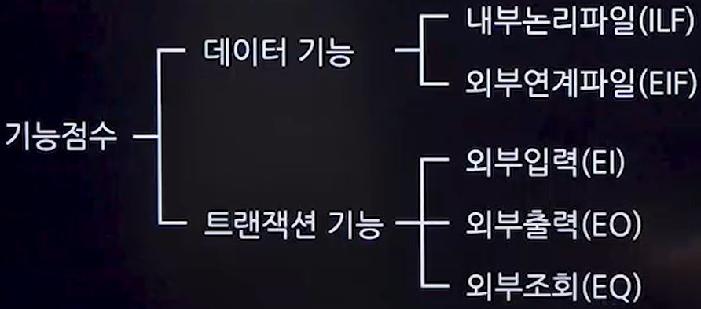

# 프로젝트 계획
## 1. 프로젝트 관리

### 1. 프로젝트 관리의 개념(잘 안나옴)
- 특정한 목적을 달성하기 위해 한정된 기간,예산,자원을 활용하여 사용자가 만족할만한 제품이나 서비스를 개발하도록 하는 기술적, 관리적 활동
### 2. 프로젝트 관리의 목적(잘 안나옴)
- 납기 준수, 예산 준수, 품질 준수를 통한 고객 만족 달성
- 고품질의 제품 개발 및 개발 절차 준수

### 3. 프로젝트 핵심 관리 대상(3P)
- 종류만 알아두기
1. 사람
   - 프로젝트 팀원과 관련 이해 관계자들
   - 이들의 역량과 협력이 프로젝트 성공의 핵심이다.
2. 문제(Problem)
   - 프로젝트의 목표 달성을 위해 해결해야 할 과제나 문제
   - 이러한 문제들을 효과적으로 분석하고 설계하는 것이 중요하다.
3. 프로세스(Process)
   - 프로젝트의 흐름을 조직하고 관리하는 방법론
   - 프로젝트의 진행을 체계적으로 관리한다.
### 4. PMBOK(Project Management Body of Knowledge)
- PMI(Project Management Institute)에서 제작한 프로젝트 관리 프로세스 및 지식 체계
- PMBOK 5단계 프로세스 그룹
    1. 1단계 : 프로젝트 착수
        - 프로젝트의 광범위한 범위를 정하는 단계
    2. 2단계 : 프로젝트 계획
        - 프로젝트의 세부 범위를 정의하고 프로젝트 관리 계획을 만드는 단계
        - 비용,품질,기간,사용 가능한 자원이 포함됨
    3. 3단계 : 프로젝트 실행
        - 프로젝트의 개발과 완료가 이루어지는 단계
    4. 4단계 : 프로젝트 통제
        - 계획 대비 목표의 진척 상황을 모니터링하고 성과를 측정하는 단계
    5. 5단계 : 프로젝트 종료
        - 프로젝트가 요구사항을 만족하는지 검증하고, 고객으로부터 확인받는 단계

## 2. 개발 비용 산정
### 1. 비용산정기법
|기법|종류|
|---|-----|
|하향식 산정 기법|- 전문가 판단기법 - 델파이 기법|
|상향식 산정 기법|- 원시 코드 라인 수(LOC,Line Of Code) - 개발 단계별 노력 기법|
|수학식 산정 기법|- COCOMO - PUTNAM기법 - FP(기능점수)기법|

### 2. 하향식 산정기법(Top-Down)
- 과거 유사 경험을 바탕으로 회의를 통해 전체 프로젝트의 비용을 산정하는 방식

|종류|설명|
|---|-----|
|전문가 판단 기법|- 조직 내 경험이 이 있는 전문가에게 비용 산정을 의뢰하는 방식|
|델파이 기법|- 여러 전문가의 의견을 종합하여 판단하는 방식 - 특정 전문가의 주관적 편견을 보완하기 위해 여러 명의 전문가로 구성된다.|

### 3. 상향식 산정기법(Bottom-Up)
|종류|설명|
|---|-----|
|원시 코드 라인 수(LOC,Line Of Code)|- 각 기능의 원시 코드 라인수의 비관치,낙관치, 중간치를 측정 후 예측치를 구하고, 이를 이용해 비용을 산정하는 기법  **- 추정LOC : (낙관치 + (4*중간치) + 비관치)/6**|

### 4. 수학적 산정 기법
**1. COCOMO 기법**
- 소프트웨어의 규모를 LOC(Line Of Code)기반으로 예측하고, 소프트웨어 종류에 따라 비용 산정 공식에 적용하여 비용을 산정하는 모델 

|개발유형|설명|
|-------|----|
|조직형(Organic Mode) | - 5만 라인 이하의 프로젝트 - 일반 업무용 소프트웨어|
|반분리형(Semidetached Mode) | - 30만 라인 이하의 프로젝트 - 운영체제, DBMS등|
|조직형(Embedded Mode) | - 30만 라인 이상의 프로젝트 - 미사일 유도 시스템, 신호기 제어 시스템|

**2. Putnam 기법**

- Putnam이 제안한 생명주기 예측 모형
- 소프트웨어 프로젝트의 전 과정에서 필요한 노력을 예측하는 모델
- 시간에 따른 노력 분포를 **Rayleigh-Norden곡선**으로 표현한다.
- 주로 대형프로젝트에서 이용되며, 프로젝트의 복잡도와 규모에 따라 노력을 예측하는데 사용된다.
- **SLIM : 렐리-노든곡선과 Putnam예측 모델을 기반으로 한 자동화 추정도구**

3. 기능 점수 기법(FP, Function Point)
- 소프트웨어의 기능 개수를 기준으로 규모를 측정하는 기법
- 1979년 IBM의 A.J Albercht에 의해 고안되었다.
- 객관적이고 정량적인 소프트웨어 규모 산출을 가능하게 한다.
- ESTIMACS : FP모형을 기반으로 한 자동화 추정 도구
- **소프트웨어 기능 분류(나올수 있음 알아두기)**

- 소프트웨어 기능 분류 및 산정 요소

|선종요소|설명|
|-------|----|
|자료 입력|사용자 또는 시스템이 입력하는 데이터의 양식 및 복잡도를 평가한다|
|정보 출력|시스템이 제공하는 출력 보고서의 양식 및 복잡도를 평가한다.|
|명령어|사용자가 시스템에 요청하는 질의의 종류 및 복잡도를 평가한다.|
|데이터 파일|시스템이 관리하는 데이터 파일의 복잡도 및 관련성을 평가한다.|
|외부 인터페이스|시스템과 필요한 외부 루틴과의 인터페이스를 평가한다.|

## 3. 개발 일정 산정
### 1. 소프트웨어 개발 일정 계획
- 소프트웨어 개발을 위해 필요한 작업을 정의하고, 이들 작업을 우선순위를 설정하여 전체 프로젝트 일정 계획을 수립힌다.
- 작업순서

|순서|설명|
|----|---|
|작업분해 (Work Breakdown Structure, WBS)|전체 작업을 작은 단위로 분해한다.|
|CPM 네트워크 작성| Critical Path Method를 사용하여 작업 순서 및 의존성을 정의한다.|
|최소 소요 기간 계산|임계경로를 산정|
|소요 Man-Month및 기간 산정 후 CPM수정|작업에 필요한 인력 및 시간을 계산하여 CPM을 업데이트한다.|
|간트 차트(Gantt Chart)로 표현|프로젝트 일정을 시각적으로 표현한다.|
