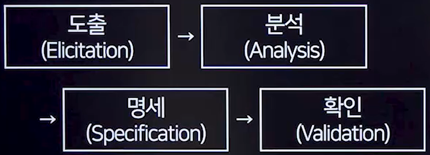
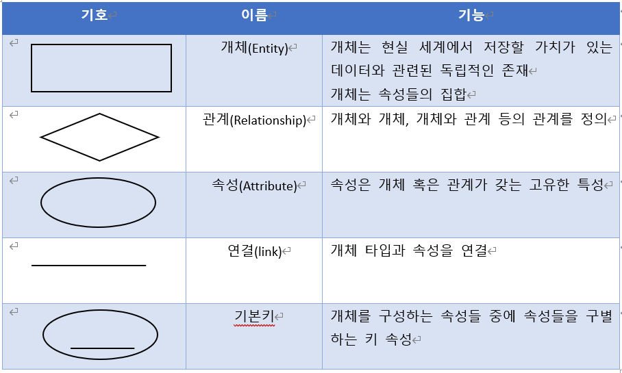

# 요구사항 분석
## 1. 현행 시스템 분석
### 1. 현행 시스템 파악
- 정의
  - 기존 시스템의 기능, 성능 그리고 문제점을 이해하고 평가하기 위한 과정

### 2. 플랫폼 기능 분석
#### 1. 플랫폼 정의
- 다양한 프로그램, 서비스 또는 기능이 구축되거나 실행되는 기반 또는 환경
#### 2. 플랫폼 기능
|기능|설명|
|----|----|
|연결기능|- 연결을 가능하게 하는 장소를 제공하여 교류 촉진|
|비용 감소 기능|- 플랫폼을 제공하여 각 그룹이 처리할 때 발생하는 시간과 비용이 절감|
|브랜드 신뢰 기능|- 플랫폼 브랜드가 사용자에게 신뢰감을 부여하여 일정 수준의 질을 보장|
|커뮤니티 형성|- 그룹간 상호작용을 통한 커뮤니티 형성|

#### 3. 플랫폼의 종류
- 하드웨어 플랫폼 ex) 윈도우
- 소프트웨어 플랫폼 
- 서비스 플랫폼

#### 4. 플랫폼의 유형
- 거래 플랫폼 ex)지마켓
- 생태계 플랫폼 ex)구글 플레이, 앱스토어
- 다면 플랫폼 ex)페이스북
#### 5. CPND(Contents Platform Network Device)
##### 개념
- 콘텐츠를 플랫폼에 맞게 가공하고 네트워크를 통해 사용자의 단말기로 서비스가 이루어짐을 표현하는 무선 인터넷 서비스의 가치사슬
##### 요소
- Contents : 텍스트,이미지,오디오,비디오등
- Platform : 웹사이트, 애플리케이션 등
- Network : 통신 시스템
- Device : 스마트폰, 컴퓨터 ,태블릿 등

### 3. 현행 시스템 분석
#### 1. 운영체제 분석
- 운영체제를 분석한다.
#### 2. 네트워크 분석
- 네트워크의 구조와 프로토콜, 대역폭, 지연 시간, 보안, 장애 복구 등에 관한 문제를 파악한다.
#### 3. DBMS분석
- 사용중인 DBMS를 분석한다.

### 4. 미들웨어 분석
#### 1. 개념
- 중간에서 매개 역할을 하는 소프트웨어

#### 2. 종류
- 원격 프로시저 호출(Remote Procedure Call)
  - 클라이언트가 원격에서 동작하는 프로시저를 호출하는 시스템
- 메세지 지향 미들웨어(Message Oriented Middleware)
  - 클라이언트가 생성한 메세지는 저장소에 요청할 때 저장하면서, 다른 업무를 지속할 수 있도록 하는 비동기식 미들웨어 ex) 동영상을 어디까지 봤는지는 정보를 웹사이트와 별개로 전달된다.

<image src="../img/메세지지향미들웨어.png" width="300px" height="300px">

- ORB(Object Request Broker)
  - 객체지향 시스템에서 객체 및 서비스를 요청하고 전송할 수 있도록 지원하는 미들웨어
- DB접속 미들웨어
  - 애플리케이션과 데이터베이스 서버를 연결해주는 미들웨어
- TP모니터(Transaction Processing Moniter)
  - 분산 시스템의 애플리케이션을 지원하는 미들웨어
  - 트랜잭션이 올바르게 처리되고 있는지 데이터를 감시하고 제어
- 웹 애플리케이션 서버(Web Application Server)
  - 웹 애플리케이션을 지원하는 미들웨어
- 엔터프라이즈 서비스 버스(Enterprise Service Bus)
  - 메세지 기반으로 느슨한 결합 형태의 표준 인터페이스 통신을 지원하는 미들웨어로 기업 안팎에 있는 모든 시스템 환경을 연동하는 미들웨어

## 2. 요구공학
### 1. 개념
- 소프트웨어의 요구사항을 식별, 분석, 문서화하고, 이를 관리하는 과정

### 2. 필요성
|필요성|종류|
|----|-----|
|비용절감|
|효율적인 프로젝트 관리|
|사용자와 개발자 간의 소통 개선|

### 3. 요구사항 개발 프로세스

#### 1. 도출
- 사용자와 이해 관계자들로부터 요구사항을 수집한다.
- 인터뷰, 설문조사, 브레인스토밍,워크샵, 직접 관찰 등 다양한 방법을 통해 수행된다.

#### 2. 분석
- 수집된 요구사항 중에서 불완전하거나 모호하며, 중복되거나 충동하는 부분을 식별하여 수정한다.
- 구조적 분석 도구
  - DFD(DataFlowDigram) : 자료 흐름도
  - DataDictionary : 자료 사전
  - Mini-Spec : 소단위 명세서
  - ERD(Entity RelationShip Diagram) : 개체 관계도
  - STD(State Transition Diagram) : 상태 전이도
- 객체지향 분석 도구
  - UML
- 도메인 분석
  - 요구 사항의 배경을 말한다.
  - 설계 모델링에 필요한 여러 개념과 비즈니스 룰을 파악한다.
#### 3. 명세
- 분석된 요구사항은 명세서 형태로 정리한다.
- 시스템이 수행해야 할 기능, 시스템이 충족해야 할 성능, 그리고 제약 조건등을 포함한다.

|구분|정형 명세 기법|비정형 명세 기법|
|---|---------------|---------------|
|기반|수학,논리학|언어,그림중심|
|작성기법|수학적 기호, 정형화된 표기법|일반 병사, 동사등의 자연어를 기반으로 서술, 다이어그램으로 작성|
|장점|명세 오류 및 모호성을 쉽게 파악|사용자/개발자 간 의사전달 용이|
|단점|어려움,시간이 많이 걸림|내용이 모호하고, 검증이 곤란|

- 요구사항 분류

|분류 | 설명|
|-----|----|
|기능 요구사항|- 시스템이 어떤 기능을 수행해야 하는지 정의 - 웹사이트에서 사용자는 로그인을 해야 한다, 주문을 할 수 있어야 한다.|
|비기능 요구사항|- 시스템이 어떻게 동작해야 하는지에 대한 요구사항 - 시스템 성능,보안,가용성, 유지보수성 등|

### 4. 확인및 검증
- 분석가가 요구사항을 이해했는지 확인
- 요구사항 문서가 일관성 있고 완전한지 검증
- 분석기법
  - 인터뷰
  - 브레인스토밍
  - 원인-효과 다이어그램
  - 프로토타이핑
  - 사용 사례(Use Case)
  - 요구사항 검토

### 5. 요구사항 분석도구
#### 1. 요구사항 분석 CASE(Computer Aided Software Engineering)
- 상위 CASE
  - 모순검사,오류검사, 자료 흐름도 작성
- 하위 CASE
  - 코드의 작성, 테스트, 문서화
- 통합 CASE
  - 전체 과정을 지원 (형상관리 ex) git)

#### 2. HIPO
- 개념
  - 하향식 소프트웨어 개발을 위한 문서화 도구
  - 시스템의 기능을 여러 개의 고유 모듈들로 분할하여 이들 간의 계층 구조를 표현한 도표
- 기능
  - 분석 및 설계 도구로 사용된다.
  - 하향식 개발에 적합하다.
  - 체계적인 문서관리에 효율적이다.
  - 기능과 자료의 의존관계를 명시할 수 있다.
- 구성요소
  - 주요 프로세스
  - 하위 프로세스
  - 입력/출력
- HIPO Char 종류
|종류|설명|
|----|----|
|가시적 도표|- 시스템 전체의 기능과 흐름을 나타내는 Tree(계층)구조 ex) 사이트맵|
|총체적 도표|- 프로그램을 구성하는 기능을 기술한것 - 입력, 처리, 출력에 대한 전반적인 정보 제공|
|세부적 도표|- 총체적 도표에 표시된 기능을 구성하는 기본요소들을 상세히 기술하는 도표 - 총체적 도표와 같은 모양이지만 좀 더 복잡하게 들어간 형태|

## 3. 요구사항 분석 모델링
### 1. 모델링 개념
- 복잡한 시스템을 이해하고 효과적으로 개발하기 위해 간단한 모델로 표현하는 과정
- 소프트웨어의 구성 모듈을 식별하고, 이들 간의 연결을 도식화 한다.
### 2. 모델링이 주는 도움
- 소프트웨어의 구조와 동작을 이해하는데 도움을 준다.
- 이해 관계자간의 의사소통을 도와 문제 해결을 용이하게 한다.
- 개념을 사용자와 고객에게 명확하게 전달한다.
- 설계,구현,테스팅,유지보수에 대한 개념적 기준을 제공한다.

### 3. 모델링 구분
- 기능적 모델링
- 정적 모델링
  - 기능의 구조 ex)회원가입에는 아이디,패스워드,이름이 있다.
- 동적 모델링
  - 시스템의 상호작용 및 동작을 표현
### 4. 분석 모델 종류
- 구조적 분석 모델
  - 하향식
- 객체 지향 분석 모델
  - 상향식

### 5. 구조적 분석 모델
#### 1. 구조적 분석 방법론
- 구조적 분석을 한다.
- 자료 흐름도 (DFD)
  - 데이터가 흘러가는 그림
  - 버블차트라고 한다.
- 자료사전(DD)
  - 자료 흐름도에 기술된 모든 자료들에 대해 자세한 정의와 설명을 제공하는 중요한 도구이다.
  - = : 자료의 정의
  - \+ : 자료의 연결
  - () : 자료의 생략
  - [|] : 자료의 성택
  - {} : 자료의 반복
  - \*\* : 자료의 설명
  -  회원정보 = 회원번호 + 회원성명 + [전화번호|휴대폰번호]
- 소단위 명세서(Mini-Specification)
  - 자료 흐름도에서 각 처리가 수행하는 업무를 상세하게 작성하는 문서
  - 포르세스 명세서 라고도 한다.
  - 처리 과정에서 어떤 이리 수행되는지 정의하고, 구체적인 작업 단계외 조건을 명시한다.
- 개체 관계도(ERD)
  
- 상태 전이도(STD)
  - 시스템의 상태와 상태 간의 전이를 모델화 하는 도구
  - 시스템에 어떤 사건이 있는지 발생했을 때 상태변화를 보여준다.
  - 개발자는 이를 통해 시스템의 행위를 정의하고 예측할 수 있다.

### 6. 객체 지향 분석 모델
#### 1. 객체 지향 분석 방법론
- Runbaugh(럼바우)방법
  - 객체 모델링
    - 객체 다이어그램
  - 동적 모델링
    - 상태 다이어그램
  - 기능 모델링
    - DFD를 이용해 데이터의 흐름과 처리과정을 표현
- Booch(부치)방법
  - 미시적 및 거시적 개발 프로세스 사용
- Jacobson방법
  - Use case를 중심으로 한 분석 방법 사용
- Coad와 Yourdon방법
  - E-R다이어그램 사용하여 객체의 행위를 모델링
- Wirfs-Brock방법
  - 분석하고 설계의 구분이 없다.