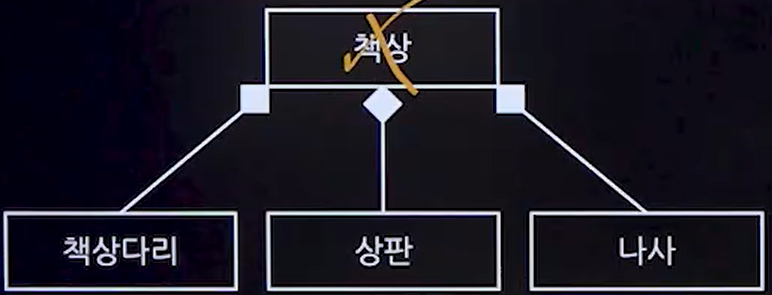

## 1. UML(Unified Modeling Language)
### 1. UML 개념
- 소프트웨어 시스템을 시각화 및 문서화하고 소프트웨어 시스템의 구조와 동작을 명세하는 표준화된 모델링 언어

### 2. UML특징
- 가시화 언어
  - 시스템의 구조와 동작을 시각적으로 표현, 복잡한 시스템을 이해하기 쉽게 한다.
- 명세화 언어
  - 시스템의 요구사항을 명세하는데 사용된다.
- 구축 언어
  - 설계와 구현에 도움이 되는 언어
- 문서화 언어
  - 시스템의 기능, 구조 동작 등을 표준화된 형태로 문서화

## 2. UML 구성요소
### 1. 사물(Things)
- 구조사물
  - 시스템의 개념적,물리적 요소
- 행동사물
  - 
- 그룹사물
- 주해사물
  - 주석,노트
### 2. 관계(Relationship)
#### 1. 일반화 관계(Generalization)
- 한 클래스가 다른 클래스를 포함하는 상위 개념일때의 관계
- 객체지향 개념에서는 일반화 관계를 상속관계(Inheritance)라고 한다.

#### 2. 연관관계(Association)
- 2개 이상 사물이 서로 관련된 관계
- 한 클래스가 다른 클래스에서 제공하는 기능을 사용할 때 표시

#### 3. 의존관계(Dependency)
- 연관 관계와 같이 한 클래스가 다른 클래스에서 제공하는 기능을 사용할 때 표시
- 두 클래스의 관계가 한 메서드를 실행하는 동안과 같이 매우 짧은 시간만 유지
- 한 클래스의 명세가 바뀌면 다른 클래스에 영향을 줌
- 한 클래스가 다른 클래스를 오퍼레이션의 매개변수로 사용

#### 4. 실체화 관계(Realization)
- 인터페이스를 구현 받아 추상 메서드를 오버라이딩하는 것을 의미
- 한 객체가 다른 객체에게 오퍼레이션을 수행하도록 

#### 5. 집합 관계 - 집약관계(Aggregation)
- 한 객체가 다른 객체를 소유하는 'has a'관계
- 전체 객체의 라이프타임과 부분 객체의 라이프타임은 독립적
- 전체 객체가 사라진다 해도 부분 객체는 사라지지 않음
- 불고기 다먹었다고 재료가 사라지지는 않음

#### 6. 집합 관계 - 합성관계(Composition)
- 부분 객체가 전체 객체에 속하는 관계로 긴밀한 필수작 관계
- 전체 객체의 라이프타임과 부분 객체의 라이프 타임은 의존적
- 전체 객체가 없어지면 부분 객체도 없어짐

### 3. 다이어그램(Diagram)
#### 1. 구조다이어그램
- 클래스 다이어그램
  - 클래스간의 관계를 표현한다.
- 객체 다이어그램
  - 객체간의 관계를 표현한다.
- 컴포넌트 다이어그램
- 배치 다이어그램
- 복합체 구조 다이어그램
- 패키지 다이어그램
  - 관련성 있는것들을 묶어놓는다.
#### 2. 행위다이어그램
- 유스케이스 다이어그램
  - 시스템의 기능과 사용자 간의 상호작용을 표현
  - 시스템이 수행해야 할 기능과 사용자의 요구사항을 문서화 하는데 사용
  - 구성요소
    - 액터(Actor)
    - 유스케이스(Use case)
    - 시스템(System)
- 순차 다이어그램
  - 객체 간의 상호작용을 시간 순서에 따라 표현 
- 커뮤니케이션 다이어그램
  - 객체 간의 상호작용과 통신을 표현
  - 객체 간의 관계와 통신에 중점을 둔다.
- 상태 다이어그램
  - 객체의 생명주기 동안의 상태 변화를 표현
- 활동 다이어그램
- 상호작용 다이어그램
- 타이밍 다이어그램

## 3. 주요 다이어그램
### 1. 클래스 다이어그램
- 속성과 행동으로 구성

### 2. 유스케이스 다이어그램
#### 1. 개념
- 시스템과 사용자의 상호작용을 다이어그램으로 표현
- 사용자의 관점에서 시스템의 서비스 혹은 기능 및 그와 관련한 외부 요소를 보여준다.
- 프로젝트에 대한 요구사항을 정의하고 세부 기능을 분석한다.
#### 2. 구성요소
1. 시스템(System)
- 만들고자 하는 프로그램 명칭

2. 액터(Actor)
- 시스템의 외부에 있고 시스템과 상호작용을 하는 사람, 시스템을 표현

3. 유스케이스(Usecase)
- 사용자 입장에서 바라본 시스템의 기능

4. 관계(Relation)
- 액터와 유스케이스 사이의 의미 있는 관계
    1. 연관관계(Association)
        - 유스케이스와 액터 간의 상호작용이 있음을 표현
        - 유스케이스와 액터를 실선으로 연결
        

    2. 포함관계(Include)
        - 유스케이스를 수행할 때 반드시 실행되어야 하는 경우
        
    3. 확장관계(Extend)
        - 유스케이스를 수행할 때 특정 조건에 따라 확장 기능 유스케이스를 수행하는 경우
       

    4. 일반화관계(Generalization)
        - 유사한 유스케이스 또는 액터를 모아 추상화한 유스케이스 
        
### 3. 시퀀스 다이어그램
#### 1. 개념
- 객체 간의 상호작용 메시지 시퀀스를 시간의 흐름에 따라 나타내는 다이어그램

#### 2. 구성요소
- 객체와 생명선
  - 객체는 직사각형으로 표현
  - 라이프라인은 객체에서 이어지는 점선으로 표현
  - 점선은 위에서 아래로 갈수록 시간의 경과를 의미
- 활성 박스
  - 생명 선상에서 기다란 직사각형으로 표현
  - 현재 객체가 어떤 활동을 하고 있음음 의미
- 메시지
  - 인스턴스 간 주고받은 데이터
  - 동기 메시지, 비동기 메시지, 자체 메시지, 반환 메시지

### 4. 상태 다이어그램
#### 1. 개념
- 한 객체의 상태 변화를 나타내는 다이어그램

#### 2. 예시

