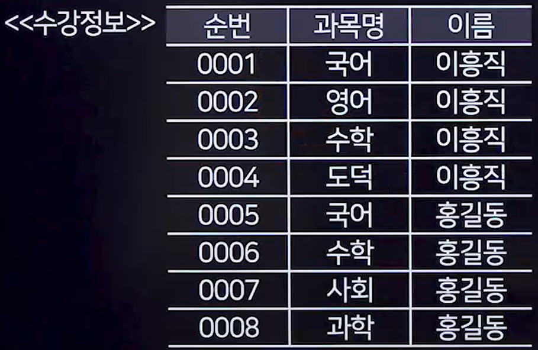
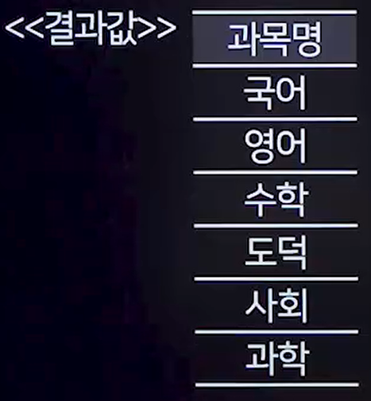
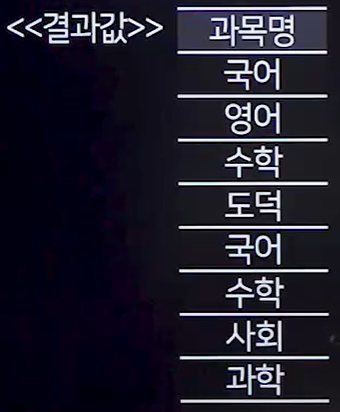
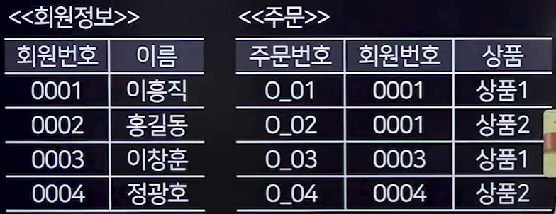
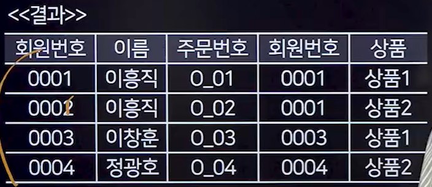
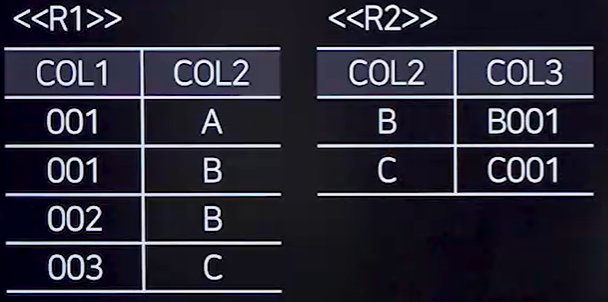
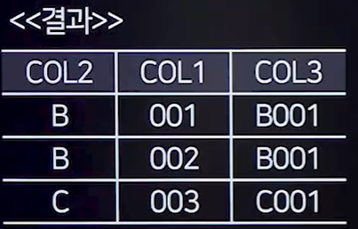

## 1. 집합 연산자
### 1. 집합 연산자
- 집합 연산자는 여러 개의 SQL 쿼리 결과를 결합하는데 사용된다.
- 두 개 이상의 테이블에서 조인을 사용하지 않고 연관된 데이터를 조회할 수 있다.
- 집합 연산자를 사용하려면, SELECT절의 컬럼 수가 동일해야 하며, 같은 위치에 있는 컬럼들은 데이터 타입이 호환 가능해야 한다.
### 2. 종류
- UNION
  - 여러 SQL문의 결과에 대한 합집합을 반환하며, **중복된 행은 제거된다.**
- UNION ALL
  - 여러 SQL문의 결과에 대한 합집합을 반환하지만, 중복된 행도 포함한다.
- INTERSECT
  - 여러 SQL문의 결과에 대한 교집합을 반환하며, 중복된 행은 제거한다.
- EXCEPT(MINUS)
  - 첫 번째 SQL문의 결과에서 두 번째 SQL문의 결과를 뺀 차집합을 반환하며, 중복된 행은 제거한다.

### 3. 사용 예


#### 1. UNION
```SQL
SELECT 과목명 FROM 수강정보 WHERE 이름='이흥직'
UNION
SELECT 과목명 FROM 수강정보 WHERE 이름='홍길동' 
```


#### 2. UNION ALL
```SQL
SELECT 과목명 FROM 수강정보 WHERE 이름='이흥직'
UNION ALL
SELECT 과목명 FROM 수강정보 WHERE 이름='홍길동' 
```



#### 3. INTERSECT
```SQL
SELECT 과목명 FROM 수강정보 WHERE 이름='이흥직'
INTERSECT
SELECT 과목명 FROM 수강정보 WHERE 이름='홍길동' 
```


#### 4. MINUS
```SQL
SELECT 과목명 FROM 수강정보 WHERE 이름='이흥직'
MINUS
SELECT 과목명 FROM 수강정보 WHERE 이름='홍길동' 
```


## 2. JOIN
### 1. 개념
- 두 개 이상의 테이블을 결합하여 데이터를 검색하는 방법
- 관련 있는 컬럼 기준으로 행을 합쳐주는 연산이다.
- 주로 Primary Key 또는 Foreign Key를 이용하여 두 테이블을 연결한다.

### 2. JOIN의 종류

#### 1. 내부 조인(Inner Join)
- 두 테이블에 공통으로 존재하는 데이터만 추출한다.
```SQL
SELECT * FROM 회원정보 INNER JOIN 주문 ON 회원정보.회원번호 = 주문.회원번호;
```


#### 2. 자연 조인(Natural Join)
- 동일한 이름과 타입을 가진 컬럼을 기준으로 자동으로 조인한다.
- 반드시 두 테이블 간의 동일한 이름, 타입을 가진 컬럼이 필요
- 조인에 이용되는 컬럼은 명시하지 않아도 자동으로 조인에 사용된다.
- 동일한 이름이 갖는 컬럼이 있지만 데이터 타입이 다르면 에러 발생
- 두 테이블이 갖는 공통 컬럼에 대해서 Inner Join은 별개의 컬럼으로 나타내지만, Natural Join은 하나의 컬럼으로 나타낸다.



```SQL
SELECT * FROM R1 NATURAL JOIN R2;
```


#### 3. Full Outer Join
- 좌측 및 우측 테이블의 데이터를 모두 포함하고, 중복된 데이터는 하나로 표시한다.
```SQL
SELECT * FROM R1 FULL OUTER JOIN R2 ON R1.COL2 = R2.COL2;
```
#### 4. Left Outer Join
- 좌측 테이블을 기준으로 조인하고, 우측 테이블에 일치하는 데이터가 없으면 NULL로 표시한다.
```SQL
SELECT * FROM R1 LEFT OUTER JOIN R2 ON R1.COL2 = R2.COL2;
```

#### 5. Right Outer Join
```SQL
SELECT * FROM R1 RIGHT OUTER JOIN R2 ON R1.COL2 = R2.COL2;
```

#### 6. Cross Join
- 두 테이블 데이터의 모든 조합을 반환
- 조인 조건이 없는 조인