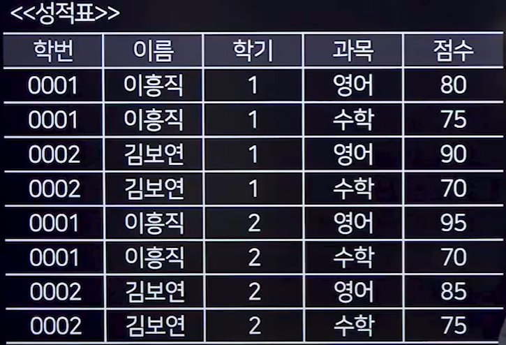

## 1. 그룹함수와 집계함수
### 1. 그룹함수
- 테이블의 전체 행을 지정한 컬럼 값에 따라 그룹화 하여 그룹별로 결과를 출력하는 함수
- 종류
  - ROLLUP
    - 그룹별 중간 집계값을 생성한다.
  - CUBE
    - 결합 가능한 값에 대한 다차원 집계를 생성한다.
  - GROUPING SETS
    - 개별 집계를 구한다.
### 2. 집계함수
- 여러 행 또는 전체 행으로부터 하나의 결과값을 반환하는 함수
- 종류
  - COUNT
    - 행의 개수를 반환
  - SUM
    - 특정 컬럼의 합계를 반환
  - AVG
    - 특정 컬럼의 평균을 반환
  - MAX
    - 특정 컬럼에서 최댓값을 반환
  - MIN
    - 특정 컬럼에서 최솟값을 반환
  - STDDEV
    - 특정 컬럼 간의 표준편차를 반환
  - VARIAN
    - 특정 컬럼 간의 분산을 계산하여 반환

## 2. 그룹함수 

### 1. ROLLUP
#### 1. 학번/학기별로 총점과 평균 구하기
```SQL
SELECT
    학번,
    학기,
    SUM(점수) AS 총점,
    AVG(점수) AS 평균
FROM 성적표
GROUP BY ROLLUP(학번,학기);
```


### 2. CUBE
- ROLLUP에서는 단지 가능한 Subtotal만을 생성하였지만, CUBE는 결합 가능한 모든 값에 대하여 다차원 집계를 생성한다.
- 그룹핑 컬럼이 가질 수 있는 모든 경우의 수에 대하여 소계(SUBTOTAL)와 총계(GRAND TOTAL)를 생성한다.
- 시스템에 많은 부담을 주기 때문에 데이터의 양이 많다면 사용을 지양한다.
```SQL
SELECT
    학번,
    학기,
    SUM(점수) AS 총점,
    AVG(점수) AS 평균
FROM 성적표
GROUP BY CUBE(학번,학기);
```

### 3. GROUPING SETS
- ROLLUP과 CUBE와 달리 계층 구조가 나타나지 않으며 다라서 인자의 순서가 달라도 결과는 똑같다.
- GROUPING SETES함수는 괄호로 묶은 집합별로도 집계를 구할 수 있다.
```SQL
SELECT
    학번,
    학기,
    SUM(점수) AS 총점,
    AVG(점수) AS 평균
FROM 성적표
GROUP BY GROUPING SETS(학번,학기);
```