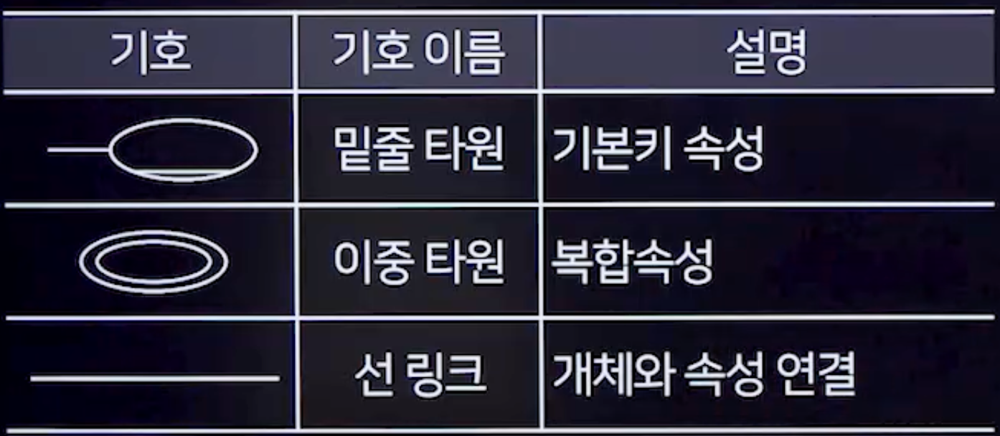

 ## 1. 데이터모델 개념
 ### 1. 데이터모델 개념
- 현실 세계의 복잡한 데이터 구조를 단순화, 추상화하여 체게적으로 표현한 개념적 모형
- 목적 : 데이터의 관계, 접근 및 처리 과정을 체계적으로 표현하기 위함
### 2. 데이터모델 종류
- 계층형 데이터 모델
- 네트워크형 데이터 모델
- 관계형 데이터 모델
- 객체지향형 데이터 모델
### 3. 데이터모델 구분
- 개념적 데이터 모델
  - 현실세계의 인식을 추상적 개념으로 표현
  - 대표적으로 개체-관계(E-R)모델
- 논리적 데이터 모델
  - 개념적 모델을 컴퓨터가 처리할 수 있는 구조로 변환
  - 관계 모델, 계층 모델, 네트워크 모델등으로 구분
- 물리적 모델
  - 데이터의 실제 저장 방법과 접근 경로를 표현
  - 레코드 형식, 레코드 순서, 접근경로, 저장방법에 관한 정의
### 4. 데이터모델 구조
- 개체(Entity)
  - 저장할 만한 가치가 있는 현실세계의 대상체
- 개체 타입(Entity type)
  - 개체를 구성하는 속성들의 집합
- 개체 인스턴스(Entity instance)
  - 구체적인 객체
- 개체 세트(Entity set)
  - 개체 인스턴스들의 집합
- 속성(Attribute)
  - 개체의 고유한 특성
- 관계(Relation)
  - 개체와 개체 간의 연관성
### 5. 데이터모델 표시해야 할 요소
- 구조
  - 데이터 구조 및 개체 간 관계
- 연산
  - 데이터 처리 방법
- 제약조건
  - 데이터의 논리적 제약조건

## 2. 개체-관계 모델(Entity Relation Model)
### 1. 개념
- 데이터베이스의 요구사항을 그래픽적으로 표현하는 모델
- 개체(Entity),속성(Attribute),관계(Relation)를 사용하여 데이터를 기술
- 피터 첸(Peter Chen)에 의해 제안
- 특정 DBMS나 하드웨어의 독립적임
- 산출물 : 개체-관계 다이어그램(Entity-Relationship Diagram)
### 2. 개체(Entity)
- 현실 세계의 독립적이고 구별 가능한 대상
- 표현 : ER다이어그램에서 사각형으로 나타낸다.
### 3. 애트리뷰트,속성(Attribute)
- 개체나 관계의 고유한 특성을 나타내는 정보의 단위
- DB에 저장할 데이터의 가장 작은 논리적 단위
- 표현 : ER 다이어그램에서 기본적으로 원으로 표현, 키 속성은 원에 밑줄 표현, 다중 값은 두 개의 원으로 표현, 유도 속성은 원을 점선으로 표현
- 속성의 유형
  - 단일 값 속성
    - 하나의 값만 갖는 속성
  - 다중 값 속성
    - 여러 값을 갖는 속성
  - 단순 속성
    - 더 이상 분해할 수 없는 속성
  - 복합 속성
    - 분해 가능한 속성
  - 유도 속성
    - 다른 속성에서 유도되는 속성
  - 널 속성
    - 값이 아직 결정되지 않거나 존재하지 않는 속성
  - 키 속성
    - 개체를 구별하기 위한 속성
### 4. 관계(Relationship)
- 두 개체 간의 의미있는 연결
- 표현 : ER다이어그램에서 관계는 마름모로 표현

- 개체 간 대응 관계 종류
  - 1 : 1
    - A의 원소와 B의 원소가 1대1로 대응
  - 1 : N
    - A의 원소는 B의 여러 원소와 대응하며, B의 원소는 A의 하나의 원소와만 대응
  - N : M
    - A와 B의 원소 모두 여러 원소와 대응

### 5. E-R다이어그램 기호

## 3. 데이터 모델의 품질 기준
- 정확성
- 완전성
- 준거성
- 최신성
- 일관성
- 활용성
