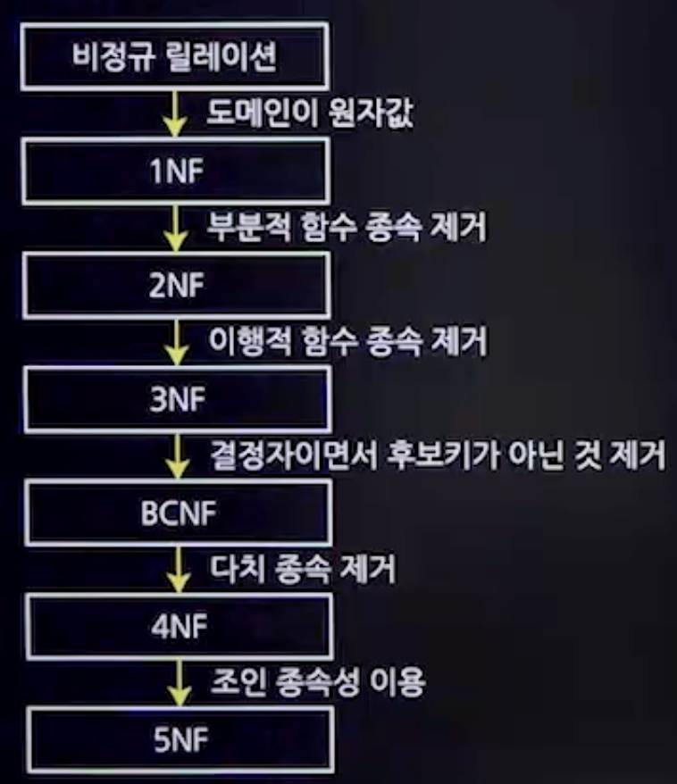

## 1. 논리적 데이터 모델링
### 1. 논리적 모델링
- 개념적 설계 단계에서 도출된 개체,속성,관계를 구조적으로 표현하는 과정
- 개념 모델에서 도출된 업무 데이터 및 규칙을 상세히 표현
- 모든 업무용 개체, 속성, 관계, 프로세스 등을 포함
- 데이터를 정규화하여 모델링
- 성능과 제약사항에 독립적이며, 특정 DBMS에서도 독립적
- 관계형 모델, 계층형 모델, 네트워크 모델 등의 종류로 구분
### 2. 논리적 데이터 모델 종류
- 관계형 데이터 모델
- 계층형 데이터 모델
- 네트워크형 데이터 모델
- 객체지향 데이터 모델

## 2. 데이터베이스 졍규화(Normalization)
### 1. 개념
- 관계형 데이터베이스의 설계에서 데이터 중복을 최소화하기 위한 과정
- 중복 데이터를 허용하지 않아, 무결성 유지와 저장 용량 절감이 가능하다.
### 2. 목적
- 데이터 중복 최소화
- 정보의 무손실 : 정보가 사라지지 않아야 함
- 독립적인 관계는 별개의 릴레이션으로 표현
- 검색 용이성 증가
- 이상 현상 최소화

### 3. 정규화의 장/단점
- 장점
  - 중복 데이터 최소화
  - 저장 공간 효율성 활용
  - 이상 현상 제거
- 단점
  - 처리 복잡성 증가
  - 실행 속도 저하
  - 참조 무결성 유지에 추가 노력 필요
  - JOIN연산 필요성 증가
### 4. 이상현상
- 데이터의 중복으로 인해 릴레이션 조작 시 발생하는 예기치 않은 문제점
- 이상의 종류
  - 삽입 이상
    - 데이터를 삽입할 때 **불필요한 데이터**가 함께 삽입되는 현상
  - 삭제 이상
    - 한 튜플을 삭제할 때 **연쇄 삭제 현상**으로 인해 정보 손실
  - 갱신 이상
    - 튜플의 속성값을 갱신할 때 **일부 튜플의 정보만 갱신**되어 정보에 모순이 생기는 현상
### 5. 함수적 종속
#### 1. 개념
- 어떤 릴레이션 R의 X와Y를 각각 속성의 부분집합이라고 가정했을 때
- X의 값을 알면 Y의 값을 바로 식별할 수 있고, X의 값에 Y의 값이 달라질 때, Y는 X의 함수적 종속이라고 한다.
- 기호로 표현하면 X -> Y
#### 2. 함수적 종속 관계
- 완전 함수 종속
  - 종속자가 기본키에만 종속되며, 기본키가 여러 속성으로 구성되어 있을 때, 기본키를 구성하는 모든 속성이 포함된 기본키의 부분집합에 종속된 경우
- 부분 함수적 종속
  - 기본키가 여러 속성으로 구성되어 있을 때, 기본키를 구성하는 속성 중 일부만 종속되는 경우
- 이행적 함수 종속
- X -> Y, Y -> Z 이러한 종속관계가 있을 경우, X -> Z가 성립되는 경우
### 6. 정규화 과정

#### 1. 제 1형정규형(1NF)
- 어떤 Relation에 속한 모든 Domain이 원자값(Atomic Value)만으로 되어 있다.

#### 2. 제 2형정규형(2NF)
- 부분 함수적 종속을 모두 제거하여 완전 함수 종속으로 만든다.

#### 3. 제 3형정규형(3NF)
- 이행적 함수 종속을 없앤다.

#### 4. 보이스/코드(BCNF) 정규형
- 3차 정규형을 조금 더 강화한 버전
- 결정자 중 후보키가 아는 것들을 제거

#### 5. 제 4정규형(4NF)
- 다치 종속 제거

#### 6. 제 5정규형(5NF)
- 조인 종속 이용