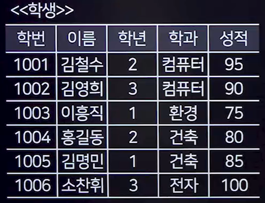
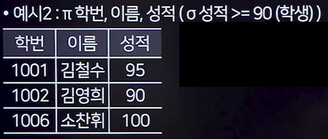
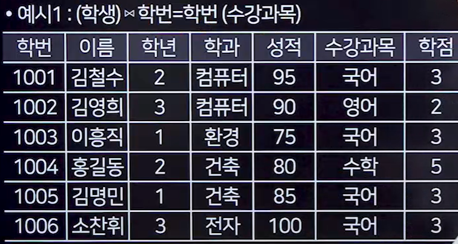
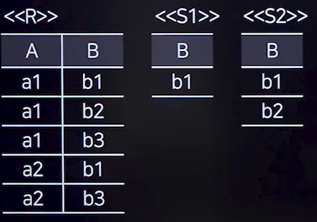
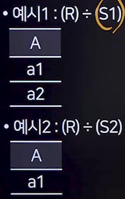
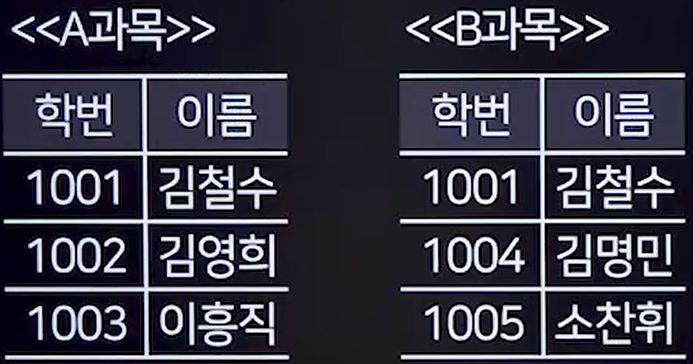

## 1. 관계 데이터 모델
### 1. 관계 데이터 모델 개념
- 데이터의 논리적 구조를 테이블 형태로 표현하는 모델로,각 테이블은 튜플(행)과 속성(열)로 구성하게 된다.
- 데이터를 정의하고 조작하는데 테이블 형식을 사용한다.

### 2. 관계 데이터 릴레이션의 구조
- 속성(Attribute)
  - 릴레이션의 열을 속성이라고 하며, 개체의 특성을 기술한다.
  - 속성의 개수는 릴레이션의 차수(Degree)를 결정한다.
- 튜플(Tuple)
  - 행을 튜플이라고 하며, 속성들의 모임이다.
  - 튜플의 수는 릴레이션의 카디널리티(Cardinality)를 의미한다.
- 도메인(Domain)
  - 속성이 가질 수 있는 값의 범위
  - 성별은 남,여를 가질 수 있고, 학년은 1~4를 가질 수 있다.
  - 도메인을 정의함으로써 데이터의 무결성을 유지할 수 있다.
- 차수(Degree)
  - 릴레이션에서 속성의 총 개수
- 카디널리티(Cardinality)
  - 릴레이션에서 튜플의 총 개수
### 3. 릴레이션
- 데이터를 2차원 테이블의 구조로 저장한것
- 릴레이션의 구성
  - 릴레이션 스키마 : 릴레이션의 이름과 속성이름을 포함한 릴레이션의 논리적 구조
  - 릴레이션 인스턴스 : 스키마에 따라 실제로 저장된 데이터의 집합
- 릴레이션의 특징
  - 튜플의 유일성 : 중복된 튜플이 존재하지 않는다.
  - 튜플의 무순서성 : 튜플 간에 순서는 없다.
  - 속성의 무순서성 : 속성 간에 순서는 없으며, 속성의 위치는 중요하지 않다.
  - 속성의 원자성 : 속성은 더 이상 분해할 수 없는 원자값을 가져야 한다.
  - 동적 변화성 : 릴레이션은 튜플의 삽입, 갱신, 삭제로 인해 실시간으로 변할 수 있다.

## 3. 관계데이터 언어(관계대수, 관계해석)
### 1. 관계 대수의 개념(절차적)
- 관계대수는 원하는 데이터를 찾기 위한 절차적언어이다.
- 데이터를 어떻게 찾아야 하는지의 처리 과정을 명시한다.
- 연산의 피연산자와 결과는 모두 릴레이션이다.
- 일반 집합 연산과 순수 관계 연산으로 구분한다.

### 2. 순수관계 연산자

#### 1. SELECT
- 주어진 조건을 만족하는 튜플을 선택한다.
- 기호 : σ(시그마)
- 표기법 : σ<조건>(릴레이션)
- 조건에서는 =, ≠, <,≤, ≥ ,> 등의 기호를 사용한 비교 연산이 허용된다.
- AND(^), OR(v), NOT(ㄱ)등의 논리 연산자를 사용한다.

#### 2. PROJECT
- 속성 리스트에 주어진 속성 값만을 추출한다.
- 기호 : 𝝅(파이)
- 표기법 𝝅<컬럼>(릴레이션)

#### 3. JOIN
- 두 릴레이션에서 연관된 튜플을 결합한다.
- 기호 : ⋈(보타이)
- 표기법 : 릴레이션A ⋈<조건> 릴레이션B

#### 4. DIVISION(잘나옴)
- 릴레이션 S의 모든 튜플과 관련이 있는 릴레이션 R의 튜플들을 반호나한다.
- 기호 : ÷(나누기)
- 표기법 : R÷S

 

- 예시1
  - B릴레이션에서 b1을 가지고 있는 A테이블의 행
- 예시2
  - B릴레이션에서 b1,b2를 가지고 있는 A테이블의 행
 

### 3. 일반 집합 연산자
#### 1. 합집합(Union)
- 두 릴레이션의 튜플 합집합을 구하며, 중복 튜플은 제거한다.
- 표기법 : U

- 결과의 순서는 상관 없음

