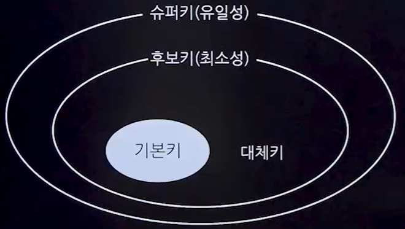
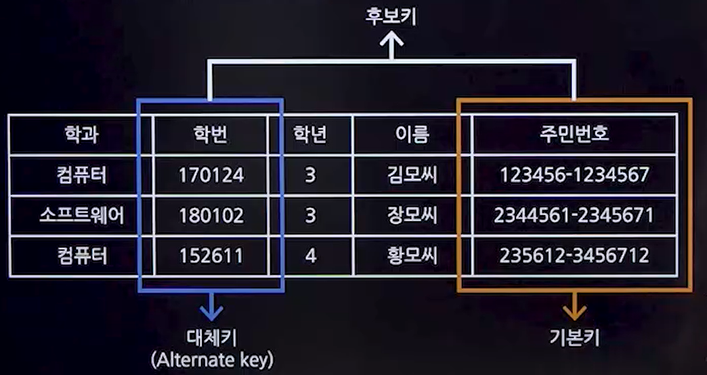

## 1. 속성(컬럼)
### 1. 개념
- 릴레이션에서 정보의 최소 단위로, 각 열을 통해 데치터의 상태나 특성을 나타낸다.
- 관계형 데이터베이스에서 컬럼을 속성이라고도 한다.

### 2. 속성의 특징
- 각 속성은 업무 프로세스에 필요한 정보로 구성되며, 하나의 속성에는 하나의 값만을 가질 수 있다.(도메인이 원자값이어야 한다.)
- 여러 값이 필요한 경우 별도의 테이블로 분리된다.

### 3. 속성의 분류
- 기본속성
  - 업무로부터 추출한 모든 속성
- 설계속성
  - 코드성 데이터, 릴레이션 식별용 일련번호
- 파생속성
  - 다른 속성에 영향을 받아 발생하는 속성
  - 계산값, 합계, 재고 등

### 4. 세부 의미에 따른 분류
- 단순속성
  - 나이,성별같이 다른 속성들로 구성될 수 없는 단순한 속성
- 복합속성
  - 주소와 같이 시,구,동처럼 여러 세부 속성들로 구성될 수 있는 속성

### 5. 구성방식 따른 분류
- PK
  - 릴레이션에서 튜플을 유일하게 구분할 수 있는 속성
- FK
  - 다른 릴레이션과의 관계에서 참조하고 있는 속성
- 일반속성
  - 릴레이션에 포함된 속성 중, PK와 FK가 아닌 속성

### 6. 도메인
- 속성의 값 범위를 정하는 것
- 속성이 가질 수 있는 가능한 모든 값의 집합

## 2. 키 종류
### 1. 키(Key)의 개념
- 키(Key)는 데이터베이스에서 튜플을 식별하고 구별하는데 사용되는 컬럼이다.
- 아래 학생 릴레이션에서 학생 튜플을 구별할 수 있는 키는 학번 컬럼이다.
### 2. 키(Key)의 종류

### 1. 후보키(Candidate Key)
- 릴레이션에서 튜플을 유일하게 식별할 수 있는 속성들의 집합
- 반드시 하나 이상 존재해야 하며, 유일성과 최소성을 만족해야 한다.

### 2. 기본키(Primary Key)
- 후보키 중에서 선택한 주키(Main Key)
- 특정 튜플을 유일하게 식별할 수 있으며, NULL값을 가질 수 없고, 중복된 값을 가질 수 없다.
### 3. 대체키(Alternate Key)
- 둘 이상의 후보키가 있을 때, 기본키로 선택되지 않은 나머지 키
### 4. 슈퍼키(Super Key)
- 튜플을 유일하게 식별할 수 있는 속성들의 집합이지만, 최소성은 만족시키지 않는다.

### 5. 외래키(Foreign Key)
- 다른 릴레이션의 기본키를 참조하는 속성
- 릴레이션 간 참조 관계를 표현하는데 사용되며, 참조 무결성 조건을 만족해야 한다.

## 3. 데이터베이스 무결성
### 1. 데이터베이스 무결성 개념
- 데이터베이스의 정확성, 일관성 및 유효성을 보장하는 데이터베이스 관리 시스템(DBMS)의 중요한 기능
- 무결성 유지는 적절한 연산 제한을 통해 이루어진다.
### 2. 데이터베이스 무결성 종류
#### 1. 개체 무결성(Entity Integrity)
- 모든 릴레이션은 중복되지 않는 고유한 값인 기본키를 가져야 한다.
- 기본키는 NULL값을 가질 수 없다.
#### 2. 참조 무결성 제약조건
- 외래키는 NULL이거나 유효한 참조 릴레이션의 기본키와 일치해야 한다.
- 참조 무결성 제약조건
  - 제한(Restrict)
    - 문제의 연산을 거부한다.
  - 연쇄(Cascade)
    - 참조된 튜플 삭제 시, 참조하는 튜플도 함께 삭제한다. 
  - 널값(Nullify)
    - 참조된 튜플 삭제 시, 참조하는 튜플의 외래키를 NULL로 설정한다.
  - 기본값(Default)
    - NULL 대신 기본값을 등록한다.
#### 3. 도메인 무결성(Domain Integrity)
- 모든 속성 값은 정의된 도메인에 속해야 한다.
- ex) '성별'컬럼에는 오직 '남'또는'여'만 허용된다.
#### 4. 고유 무결성(Unique Integrity)
- 릴레이션의 특정 속성 값은 서로 달라야 한다.
#### 5. 키 무결성(Key Integrity)
- 각 릴레이션은 적어도 하나의 키를 가져야 한다.