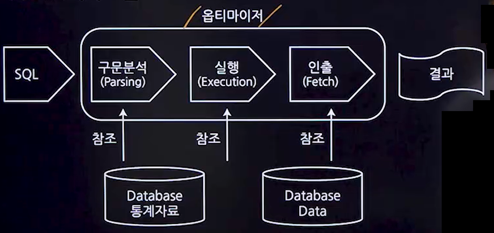

## 1. CRUD분석
### 1. CRUD의 개념
- 데이터 처리기능인 Create(생성), Read(읽기), Update(갱신), Delete(삭제)를 묶어서 표현하는 말이다.
- 시스템 구축 시 프로세스와 DB에 저장되는 데이터 사이의 의존관계를 표현하는 표이다.
- 시스템을 구축하기 위해 해당 업무에 어떤 데이터가 존재하는지 무엇이 영향을 받는지 분석
- 데이터베이스에 영향을 주는 생성, 읽기, 갱신, 삭제 연산으로 프로세스와 테이블 간에 매트릭스를 만들어서 트랜잭션을 분석
### 2. CRUD의 필요성
#### 1. 모델링 작업검증
- 데이터 모델링과 프로세스 모델링이 정확하게 수행되었는지 확인하는 데 사용된다.
#### 2. 중요 산출물
- 시스템 구축 단계에서의 중요한 참고 자료로 활용되며, 구축되는 시스템의 데이터 처리를 명확하게 정의한다.
#### 3. 테스트 시 사용
- 시스템 테스트 시 테스트 케이스로 활용되며, 각 테스트 단계에서 예상되는 데이터의 변화를 확인한다.
#### 4. 인터페이스 현황 파악
- 전체 업무 프로세스에서 발생하는 인터페이스를 파악하고, 어떤 데이터가 어떤 방식으로 교환되는지 이해하는데 도움을 준다.

## 2. 옵티마이저
### 1. SQL 처리 흐름

#### 1. 구문분석 단계
- 사용자가 제출한 SQL문이 데이터베이스에서 이미 사용된 적이 있는지 확인한다.
- 이미 처리된 적이 있다면, 구문 분석 단계를 건너뛰고 캐시된 실행 계획을 재사용한다.
- SQL문법의 정확성, SQL문 내의 테이블과 뷰가 실제로 데이터베이스에 존재하는지 등을 확인한다.

#### 2. 실행단계
- SQL문에서 참조된 데이터가 '데이터 버퍼 캐시'영역에 있는지 검사한다.
- 데이터 버퍼 캐시는 자주 접근하는 데이터를 메모리에 저장하여 빠른 접근을 가능하게 만든다.
- 데이터가 캐시에 존재한다면, 디스크에서 데이터를 읽지 않고 캐시에서 바로 데이터를 추출한다.
- 데이터가 캐시에 없다면, 디스크에서 데이터를 읽어 캐시에 로드하고 처리한다.

#### 3. 추출단계
- 실행 단계가 완료되면, 서버 프로세스는 데이터 버퍼 캐시 영역에서 관련 데이터를 읽어 사용자에게 전달한다.
- SELECT문을 실행하는 경우에만 추출단계가 실행되고, UPDATE, INSERT,DELETE문 실행시 추출단계는 실행되지 않는다.

### 2. 옵티마이저 개념
- 옵티마이저는 SQL문에 대한 최적의 실행 방법을 결정한다.
- 옵티마이저의 구분
  - 규칙기반 옵티마이저
    - 규칙(우선순위)을 가지고 실행 계획을 생성
    - 인덱스의 유무, 연산자, 객체 등을 참조하여 우선순위를 부여
  - 비용기반 옵티마이저
    - SQL문을 처리하는 데 필요한 비용이 가장 적은 실행계획을 선택하는 방식
    - 소요시간이나 자원 사용량을 가지고 실행계획 생성
    - 테이블, 인덱스, 컬럼 등의 다양한 객체 통계정보와 시스템 통계정보 활용

## 3. SQL 성능 튜닝
### 1. 튜닝의 개념
- SQL문을 최적화하여 시스템의 처리량과 응답 속도를 개선하는 작업이다.
### 2. 튜닝의 접근 방법
- 부하의 감소
- 부하의 조정
- 부하의 병렬 수행
### 3. 튜닝 영역
- 데이터베이스 설계튜닝
- 데이터베이스 환경
- **SQL문장 튜닝**
  - SQL문장 자체를 최적화하여 성능을 개선한다.
### 4. 튜닝절차
- 시스템 현황 분석
- 문제점 탐지 및 원인 분석
- 목표 설정
- 튜닝 시행
- 결과 분석

### 5. SQL 성능 최적화를 위한 유틸리티
- SQL Trace
- TKPROF(Trace Kernel PROFile)
- EXPLAIN PLAN

### 6. Row Migration/ Row Chaining
#### 1. Row Migration
- 데이터가 수정되면서 데이터가 더 커져서 기존 블록(Block)에 못 들어가는 경우
- 다른 블록에 데이터를 넣고 기존 블록 위치에는 링크를 남긴다.
#### 2. Row Chaining
- 컬럼이 너무 길어서 DB Block 사이즈보다 길어진 경우 블록 두 개에 이어서 한 Row가 저장

