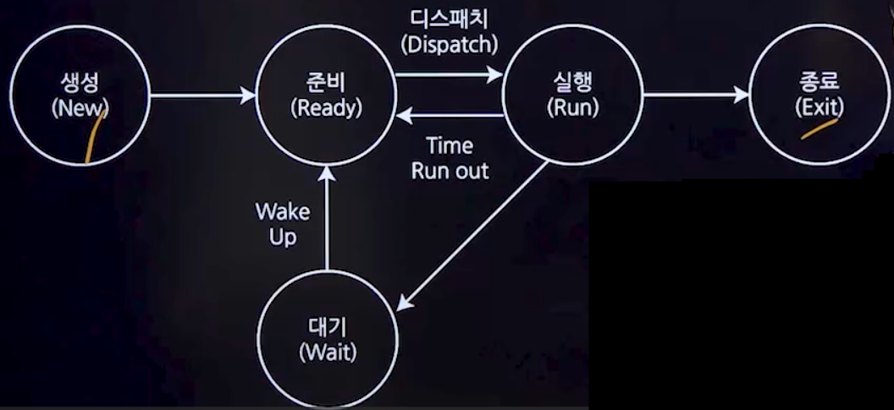

## 1. 프로세스
### 1. 프로세스의 개념
- 컴퓨터에서 연속적으로 실행되고 있는 컴퓨터 프로그램
- 실행 가능한 프로세스 제어 블록(Process Control Block, PCB)을 가진 프로그램
- 운영체제가 관리하는 실행단위로, 프로세서가 항당되는 실체
- 활동중인 프로시저

### 2. 스레드
#### 1. 스레드의 개념
- 프로세스 내에서 실행되는 흐름의 단위
- 하나의 프로세스는 최소 하나 이상의 스레드를 가지며, 스레드는 '경량 프로세스'라고도 불린다.
- 각 스레드는 독립된 스택 영역을 가지지만, 부모 프로세스의 코드, 데이터, 힙 영역은 공유한다.

#### 2. 스레드의 특징
- 프로세스 생성보다 스레드 생성 비용측면에서 더 효율적이다.
- 멀티프로세서 환경에서 스레드는 병렬실행을 통해 성능을 향싱시킬 수 있다.
- 스레드 구현 및 디버깅은 상대적으로 어렵다.
- 동기화 문제와 교착 상태(Deadlock)를 주의해야 한다. 

#### 3. 스레드의 분류
- 사용자 수준의 스레드
  - 사용자 정의 라이브러리를 사용하여 스레드를 관리한다.
  - 구현 속도는 빠르지만, 구현 자체가 어렵다.
- 커널 수준의 스레드
  - 운영체제의 커널이 스레드를 관리한다.
  - 구현이 상대적으로 쉽지만, 사용자 수준 스레드에 비해 느리다.

### 3. 메모리상의 프로세스 영역
- 코드 영역
  - 프로그램의 코드가 저장되는 영역
  - 함수, 제어문, 상수 등
- 데이터 영역
  - 전역변수와 정적변수가 할당되는 부분
- 스택 영역
  - 지역변수와 매개변수가 저장된다.
  - 함수 호출이 완료되면 해당 정보는 사라진다.
- 힙 영역
  - 프로그래머가 할당하고 해제하는 메모리 공간
  - 동적할당 

### 4. 프로세스 상태전이

#### 1. 프로세스 상태 전이 절차
- 제출(Submit)
  - 사용자가 작업을 시스템에 제출한 상태
- 접수(Hold)
  - 제출된 작업이 디스크의 Spool 공간에 저장된 상태
- 준비(Ready)
  - 프로세스가 프로세서 할당을 기다리는 상태
- 실행(Running)
  - 프로세스가 프로세서를 할당받아 실행되는 상태
- 대기(Wait)
  - I/O처리가 필요하여 실행을 중단하고 대기 중인 상태
- 종료(Exit)
  - 프로세스 실행이 끝나고 할당이 해제된 상태

#### 2. 프로세스 상태 전이 용어
- 디스패치(Dispatch)
  - 준비 상태에서 실행 상태로 전이되는 과정
- Wake Up
  - 대기 상태에서 준비 상태로 전이되는 과정
- Spooling
  - 입/출력 데이터를 모아뒀다가 한꺼번에 입/출력하기 위해 디스크에 저장하는 과정

### 5. PCB(Process Control Block, 프로세스 제어 블록)
- PCB는 운영체제가 프로세스의 정보를 저장하는 공간
- 각 프로세스가 생성될 때마다 고유한 PCB가 생성되며, 프로세스 종료 시 해당 PCB는 제거된다.
- PCB에 저장되는 정보
  - 프로세스의 현재 상태
  - 프로세스의 포인터(부모 프로세스, 자식 프로세스 등)
  - 프로세스 고유 식별자
  - 스케쥴링 정보 및 프로세스 우선순위
  - cpu 레지스터 정보
  - 주기억장치 관리 정보

### 6. 문맥교환(Context Switching)
- 하나의 프로세스가 CPU사용을 마치고 다른 프로세스가 CPU를 사용하도록 전환하는 과정
- 이 과정에서 현재 실행중인 프로세스의 상태(문맥)는 프로세스 제어 블록(PCB)에 저장되고, 새로운 프로세스의 상태는 PCB에서 읽어 CPU 레지스터에 적재된다.

## 2. 프로세스 스케쥴링
### 1. 개념
- 메모리에 올라온 프로세스들 중 어느 프로세스를 먼저 처리할지 순서를 정하는것
- Ready Queue에 있는 프로세스들 중 CPU에 할당받은 프로세스를 결정하는 과정

### 2. 스케쥴링의 목적
- 공평성
  - 모든 프로세서스가 자원을 공평하게 배정받아야 한다.
- 효율성
  - 시스템 자원을 최대한 활용하여 스케쥴링을 진행해야 한다. 
- 안정성
  - 중요한 프로세스가 우선적으로 처리되어야 한다.
- 반응 시간 보장
- 무한 연기 방지

### 3. 스케쥴링 성능척도
- 프로세서 차원
  - CPU 사용율
- 프로세스 차원
  - 응답시간
  - 대기시간
  - 반환시간

### 4. 스케쥴링 기법
#### 1. 선점형 스케줄링
- 운영체제가 실행 중인 프로세스로부터 CPU를 강제로 빼앗을수 있는 방식
- 오버헤드가 많이 발생할 수 있다.
- 종류
  - Round Robin, SRT, 다단계 큐, 다단계 피드백 큐
#### 2. 비선점형 스케줄링
- 프로세스가 cpu를 점유하고 있다면 이를 빼앗을 수 없는 방식
- 공정성을 보장하고 문맥 교환 오버헤드가 적지만, 처리율이 떨어질 수 있다.
- 종류 : FCFS,SJF,HRN,우선순위,기한부

#### 3. 기아현상과 에이징 기법
- 기아현상
  - 시스템에 부하가 많아서 우선순위가 낮은 프로세스가 무한정 기다리는 현상
- 에이징 기법
  - 기아현상을 해결하기 위한 기법
  - 오랫동안 기다린 프로세스에게 우선순위를 높여주는 기법

## 3. 스케줄링 알고리즘
### 1. 선점형 기법
#### 1. Round Robin
- 시간 단위를 정하여 프로세스에 순서대로 CPU를 할당하는 방식
- 컴퓨터 자원을 사용할 기회를 프로세스들에게 공정하게 부여하기 위한 방법

#### 2. SRT(Shortest Remaining Time)
- SRT 스케줄링의 프로세스 처리

#### 3. 다단계 큐
- 프로세스를 특정 그룹으로 분류하고, 각 그룹에 따라 다른 준비 상태 큐를 사용하는 기법
- 특정 그룹의 준비 상태 큐에 들어간 프로세스는 다른 준비 상태 큐로 이동할 수 없다.

### 2. 비 선점형 기법
#### 1. FCFS(First Come First Serve)
- 먼저 도착한 프로세스를 먼저 처리하는 스케줄링 기법
- 공평성이 유지되지만, 실행 시간이 긴 프로세스가 먼저 도착할 경우 효율성이 떨어질 수 있다.

#### 2. SJF