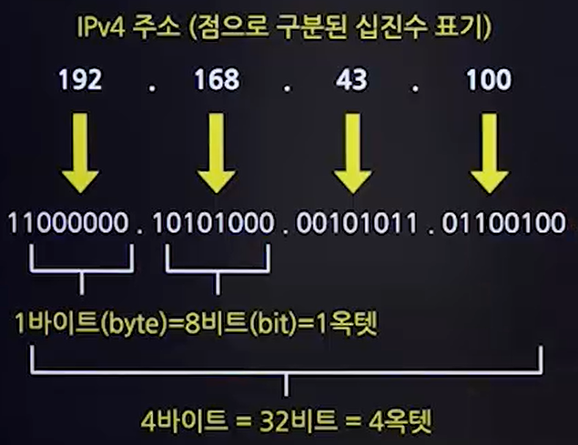
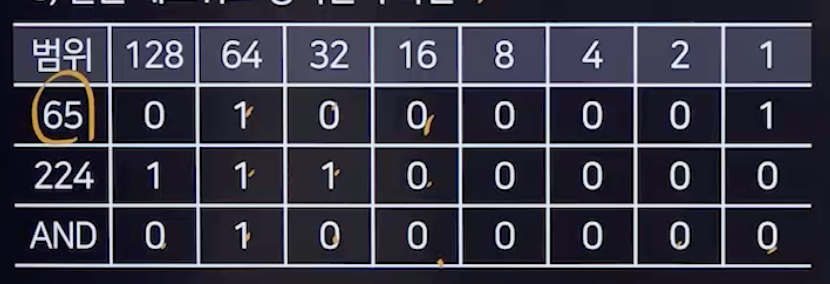

## 1. 인터넷
### 1. 개념
- TCP/IP 프로토콜을 기반으로 전 세계의 다양한 컴퓨터와 네트워크들이 연결된 광범위한 통신망
- 1960년대 미국 국방성에서 군사 목적으로 시작된 ARPANET에서 유래
- 쌍방향 통신이 가능

### 2. 인터넷 서비스
- WWW(World Wide Web)
  - 인터넷상의 텍스느, 이미지 비디오, 오디오 등을 연결하는 종합정보 서비스
  - HTTP프로토콜과 하이퍼텍스트 기반
  - 웹 브라우저를 통해 웹 내용에 접근
- 전자우편(E-mail)
  - SMTP, POP3, MIME 프로토콜 사용
- 텔넷(Telnet)
  - 원격 위치의 컴퓨터에 접속하여 사용하는 서비스
- HTTP
  - 하이퍼텍스트 문서 정송에 사용되는 프로토콜
- FTP
  - 파일 전송에 사용되는 프로토콜
- 아키
  - 익명 FTP정보를 검색할 수 있는 서비스
- 고퍼
  - 메뉴 방식을 통한 정보 검색 서비스
- 유즈넷
  - 분야별로 관심사를 공유하는 인터넷 사용자들이 의견을 주고받는 서비스

## 2. IP
### 1. IP주소
#### 1. IP의 개념
- 인터넷에서 컴퓨터나 다른 네트워크 장치를 식별할 수 있는 고유한 번호
- IPv4와 IPv6
  - 현재 널리 사용되는 주소 형식은 IPv4이다.
  - IPv4는 총 32비트로 구성되며, 8비트씩 4부분으로 나뉜다.
  - IPv6는 IPv4의 주소 공간 부족 문제를 해결하기 위해 개발된 보다 긴 주소 형식이다.
- 서브넷 마스크
  - 네트워크 부분과 호스트 부분을 구분하기 위해 사용된다.
#### 2. 표시형식

#### 3. 주소분류
- 유니캐스트
  - 단일 송신자와 단일 수신자 간의 통신
- 멀티캐스트
  - 단일 송신자와 다중 수신자 간의 통신
- 브로드캐스트
  - 같은 네트워크의 모든 장비에게 보내는 통신

#### 4. IP주소 클래스
- A Class
  - 옥텟 IP : 0 ~ 127
  - 최상비트 : 0
- B Class
  - 옥텟 IP : 128 ~ 191
  - 최상비트 : 10
- C Class
  - 옥텟 IP : 192 ~ 223
  - 최상비트 : 110
- D Class
  - 옥텟 IP : 224 ~ 239
  - 최상비트 : 1110
- E Class
  - 옥텟 IP : 240 ~ 255
  - 최상비트 : 1111

### 2. IPv6
#### 1. 개념
- IPv4주소 고갈 문제를 해결하기 위해 개발된 차세대 인터넷 프로토콜 주소
- 128비트 크기로 확장된 주소 체계를 가짐

#### 2. 특징
- 헤더 처리의 오버헤드 최소화 설계
- 128비트로 표현된 확장된 주소 공간
- 계층적 주소 할당 체계
- 자동화된 주소 설정 지원
- 기본 보안 기능 제공
- 개선된 품질 보장(Quality of Service, Qos)지원
- 확장성 있는 헤더 구조
- 패킷 크기 확장 가능성

#### 3. 표시형식
- 16비트씩 8부분, 128비트로 구성되며, 콜론(:)으로 구분한다.

#### 4. IPv6 헤더
- IPv6 기본헤더
  - 확장 헤더를 포함하지 않은 경우의 기본 헤더(40바이트)

#### 5. 주소분류
- 유니캐스트
  - 단일 송신자 단일 수신자
- 멀티캐스트
  - 단일 송신자 다중 수신자
- 애니캐스트
  - 그룹 내 가장 가까운 수신자에게 전달

#### 6. IPv4/IPv6 전환기술
- 듀얼 스택
  - 장비들이 IPv4및 IPv6을 모두 지원하며, 두 프로토콜을 동시에 처리 가능
- 터널링
  - IPv6 패킷을 IPv4패킷 속에 캡슐화하여 전송하는 기술
- 주소 변환
  - IPv6 시스템과 IPv4시스템 간의 헤더 변환을 통해 상호 운영성을 제공

## 3. 서브넷
### 1. 서브넷, 서브넷 마스크
#### 1. 서브넷
- 하나의 큰 네트워크를 더 작은 네트워크로 분할한 것
- 네트워크 관리를 용이하게 하고, 보안 및 트래픽 관리에 도움을 준다.

#### 2. 서브네팅
- 네트워크의 성능을 보장하고 자원을 효율적으로 분배하기 위해, 하나의 IP 네트워크를 더 작은 네트워크 영역으로 나누는 과정
- 네트워크 영역과 호스트 영역을 나누어 관리하는 작업을 포함

#### 3.서브넷 마스크
- IP주소에서 네트워크 부분과 호스트 부분을 구분하는데 사용된다.
- 서브넷 마스크와 IP주소의 AND연산을 통해 네크워크 주소를 결정
- 서브
### 2. 서브네팅 예
#### 1. 200.1.1.0 / 24를 7개의 subnet으로 나눌 경우
- 네트워크 영역 + 호스트 영역으로 구분 해야 한다.
- (11111111.11111111.1111111) 네트워크 영역(.00000000) 호스트 영역
##### 2. 200.1.1.65/27의 서브넷 마스크
- 호스트 주소 중 3비트를 네트워크 아이디로 사용하여, 255.255.255.224이 서브넷 마스크가됨
- 11111111.1111111.111111111.11100000 -> 255.255.255.224

#### 3. 같은 네트워크 영역인지 확인

- AND연산을 한다.

## 4. IP 기타기술
### 1. NAT(Network Address Translation)
#### 1. 개념
- 사설 IP주소와 공인 IP주소 간의 변환을 통해 내부 네트워크와 외부 네트워크 간의 통신을 가능하게 하는 기술
- IPv4주소 고갈 문제 해결을 위해 개발

#### 2. 사용목적
- 공인 IP 주소의 절약
- 내부 네트워크의 보안 강화

#### 3. 주소 할당 방식에 따른 NAT종류
- Static NAT
  - 공인 IP주소와 사설IP주소를 1:1로 매칭
- Dynamic NAT
  - 여러 공인 IP주소를 사설 IP주소와 매칭할 때 사용
- PAT
  - 한 개의 공인 IP주소에 여러 개의 사설 IP주소를 매핑, 포트 번호를 이용해 구분

### 2. DNS
- 도메인 이름을 IP주소로 변환하거나 그 반대의 작업을 수행하는 시스템
- DNS 서버는 도메인 이름과 해당 IP주소의 데이터베이스를 유지하고, 이를 요청하는 컴퓨터에 제공

### 3. QoS
- 네트워크 자원을 효율적으로 사용하여 특정 트래픽의 성능과 속도를 보장하는 기술

### 4. VPN
- 공용 네트워크를 통해 사설 네트워크에 안전하게 접속할 수 있게 하는 기술
- 데이터 암호화와 안전한 터널링을 통해 보안과 개인정보를 제공

### 5. DHCP
- 네트워크 장치에 자동으로 IP 주소를 할당하는 프로토콜
- 네트워크 관리를 간소화하고 IP 주소사용을 효율적으로 만듦